# Visualize export and import values in top 6 countreis

In this assignment, data is taken from Department of Statistics to analyze merchandise trade with Singapore by region. Analysis is performed on export and import values from 2019 to 2020 in top 6 countries, Mainland China, United States, Malaysia, Hong Kong, Japan and Taiwan. 


## 1. Original visualization and critics
#### ORIGINAL GRAPH
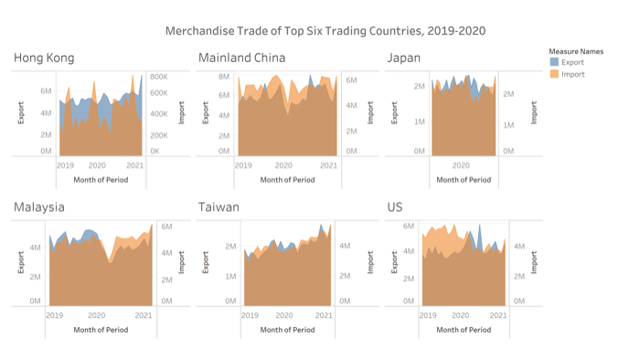

#### CRITIC -  CLARITY
* There is no clear purpose of the graph. From comparison of import and export, there is hardly any insights drawn as the graphs all look similar
* The duration is not consistent. While the rest are plotted agains months from 2019 to 2021, exports and imports in Japan is plotted agains 2020 only. 
* The export and import axis range is not consistent. For example, in Hong Kong and US, export amount is plotted from 0 to 6M. In Taiwan and Japan, the y-axis range is from 0 to 2M. There is no way to compare across countries. 
* Import and Export are using different ranges and should not be compared or overlay. 
* The graph does not show the rank among these countries even though title says they are the top 6.
* The axis tick marks are misleading by suggesting the values are in Million dollars. In fact, the values are in thousands. 6M in the axis means 6M thousands dollars
* Source of the data is not stated anywhere

#### CRITIC - AETHETICS
* The size of the subplots are not consistent. The plot of Mainland China and Malaysia are clearly larger than the one for Hong Kong and Japan. The axis are not aligned. 
* X-axis name is not clear. It is denoted as month of period while the axis is showing year
* The shading of graph is unnecessary as the line graph itself is enough to show trend. Shading overlaps with each other makes it hard to interpret. 
* Too much empty space taken up by the axis. As a result, the graphs look very small. 

## 2. Proposed visualization sketch  
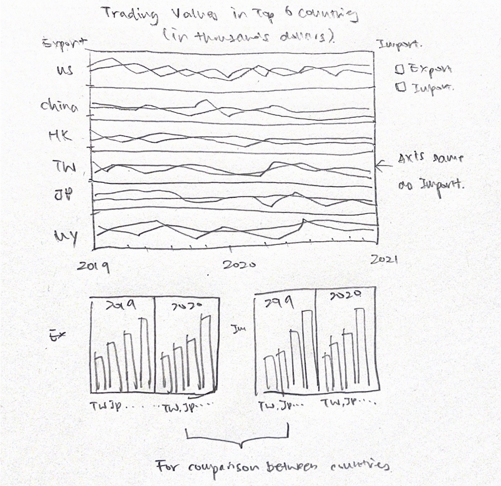  
**Advantages using proposed plot**  
1. 3 plots have their own purpose. (Top: to show a general trend in each country; Bottom Left: to compare export trading between countries; Bottom Right: to compare import trading between countries )  
2. The duration of plot is made consistent in all 3 graphs, from 2019 Jan to 2020 Dec.  
3. Dual Axis range are to be made consistent for easy comparison within each country.  
4. Title specifies the values are in thousands.  
5. It uses line graph to avoid shading overlaping.   
6. Graphs will be aligned amd adjusted to have minimal empty space.   

## 3. New visualization using Tableau
The visualization can be found [here](https://public.tableau.com/app/profile/xiaozhu.mao/viz/DataViz_assign1/Dashboard1) in Tableau Public.

### 1) Preparation and import  

* Remove unnecessary data: export and import value before 2019 and after 2021 is removed. When importing the data to Tableau, filter out data only from top 6. 
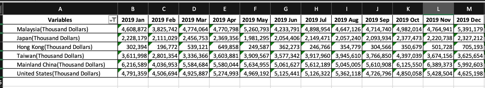{width=75%}
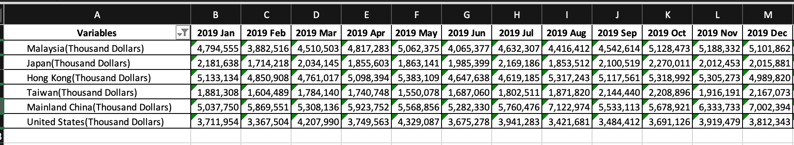{width=75%}
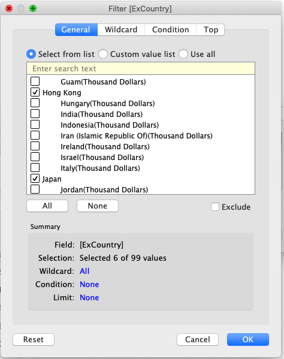{width=50%}    
* Select all data and pivot. Do the same for both Import table and Export table. 
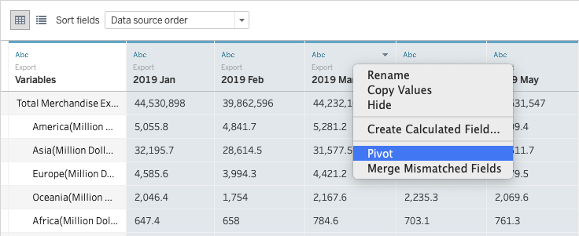{width=80%}   

* Change the column name and data format accordingly.   
ExMonthYear, ImMonthYear: date
ExVal, ImVal: numeric(whole)
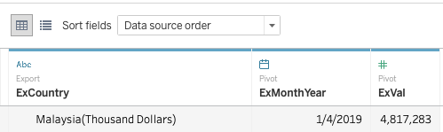   
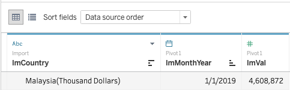  
* Join Export table and Import table on conditions: 1. country name; 2.MonthYear
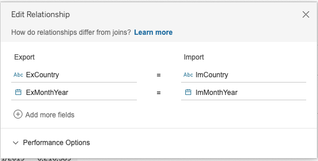

### 2) Plotting the graph    
#### Sheet 1  
In sheet 1, we aim to visualize a general trend of import and export in 6 countries over time. It is used to compare import and export within each country and to observe any trend over time.

* Drag ExMonthYear from export table to column, sum of export values and sum of import values to rows. Set them as dual axis. Drag ExCountry(country name in export table) to rows column before summation values. Change ExMonthYear to continuous Month.
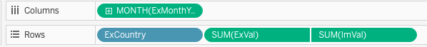{width=80%}
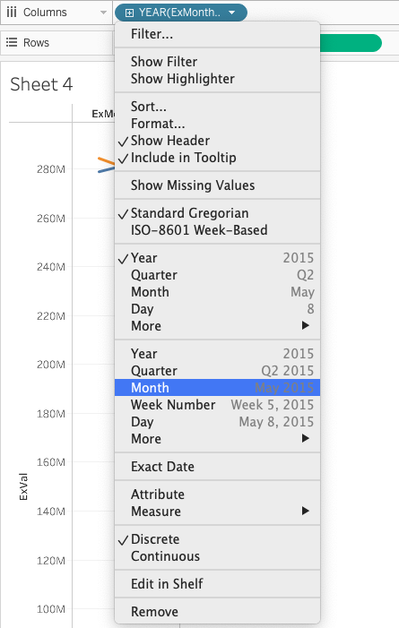{width=80%}
* Click on ImVal Axis and tick "Synchronize dual axes" so both axis have the same range.  
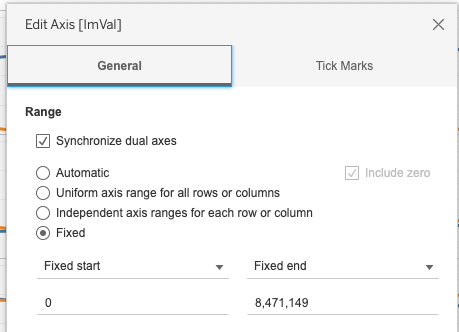
* In format of each axis, ExVal and ImVal, change the Font color to match the graph color. Blue - Export; Orange - Import.  
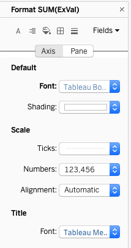
* From the graph, there are a few sudden drop and sudden increase. To make them clearer in a static graph, they are annotated out.   
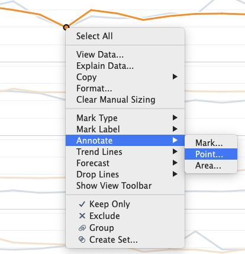{width=50%} 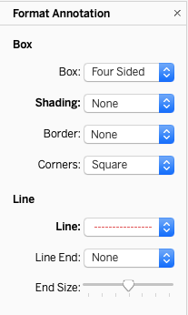{width=50%}
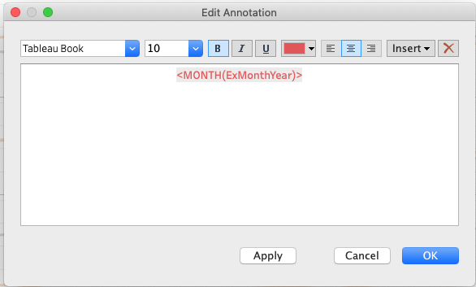{width=50%}    
**The final result after adjusting sizes and editing the title is as below:**
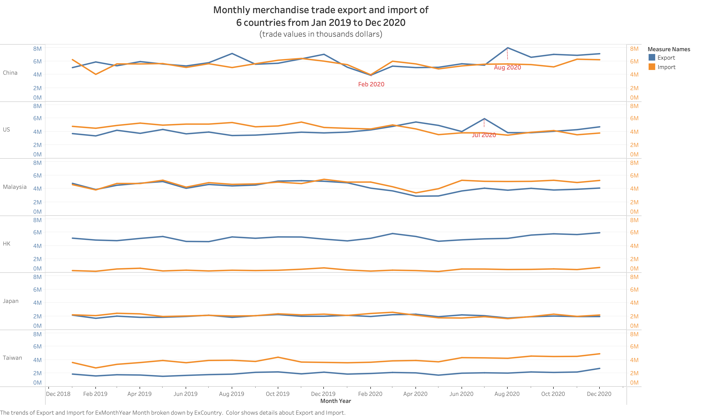{width=90%}

#### Sheet 2    
In sheet 2 and sheet 3, the goal is to compare export and import among 6 countries.
Sheet 2 visualizes Export whereas sheet 3 visualizes Import.

* Drag ExMonthYear and ExCountry to columns, and Sum of ExVal to rows. 
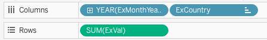
* Change the marks type to Bar and drag ExCountry, the country names, to color.
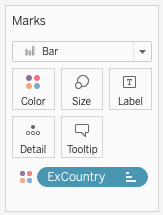
* Sort the bar charts by ascending order so the highest appear on the right. 
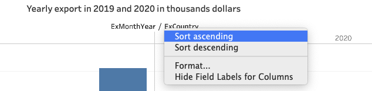{width=80%}
* From observation of the graph, US and Malaysia are to be taken special attention. Change their colors and leave the rest as the same. So US and Malaysia will standout. Change by right click the legends-Edit Colors
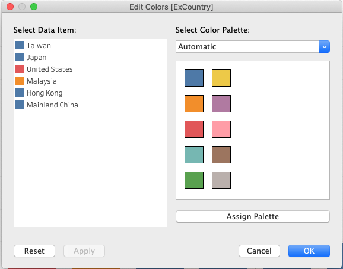{width=90%}
* Change the Axis color to blue to be consistent with Sheet 1.   
  
**The final result after adjusting size and editing title is as below:**  
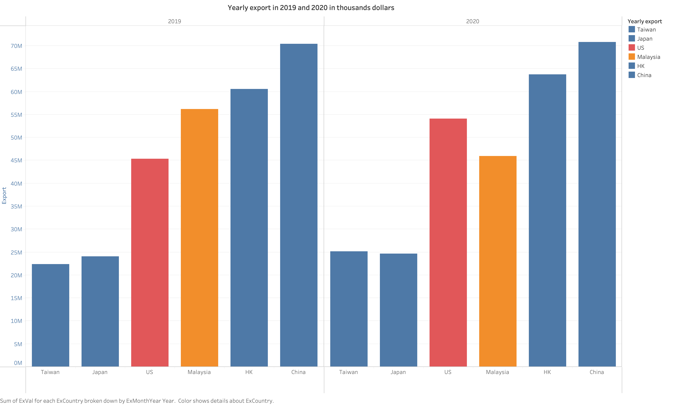{width=75%}  

#### Sheet 3    
Sheet 3 is the same as sheet 2 but values used are from Import table.

* Drag values to columns and rows. 
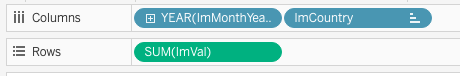
* Change mark type to Bar and drag ImCountry, the country names, to assign colors.  
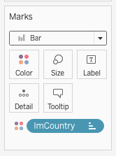
* Sort bar chart in ascending order by right click on the axis.
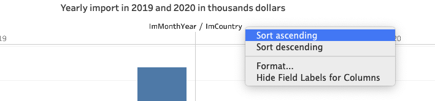{width=80%}  
* From observation, Import in 2019 and 2020 differs significantly in US. To highlight this for attention, change the color and leave the rest as the same.
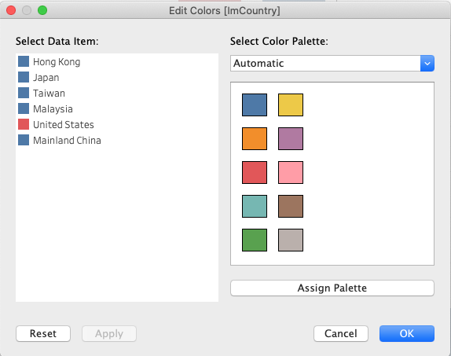{width=90%}  
**The final result after adjusting size and editing title is as below: **  
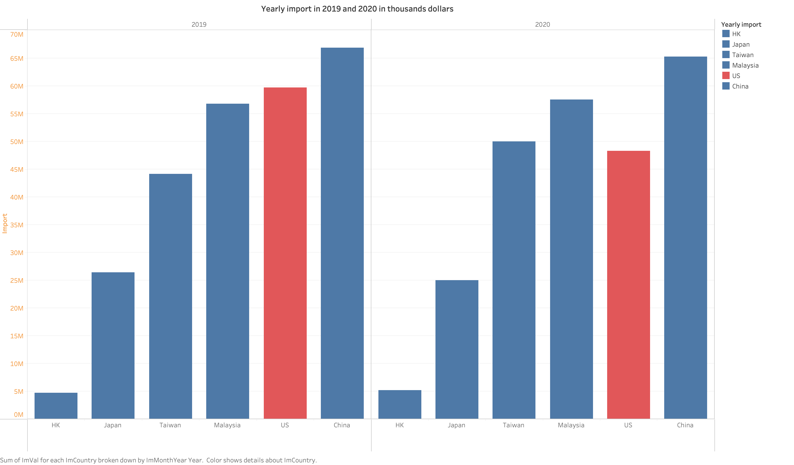{width=75%}   

### 3) Joining to a dashboard  
In this assignment, a dashboard is used to show all 3 plots.

* Drag all 3 sheets to the main dashboard area.   
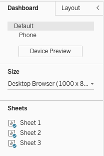   
* Add in another text block to state source of data.   
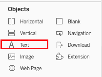 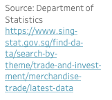

* After adjusting size and alignment, the final view of the dashboard is as below: 
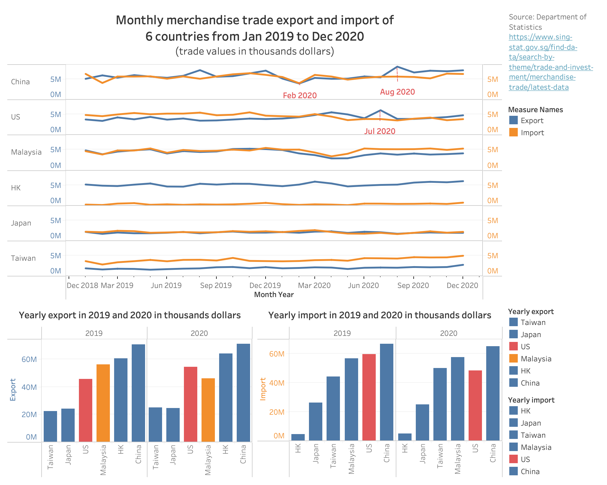{width=90%} 

## 4. Observation

* In general, in the 6 countries, import and export values do not change much over the two years. Especially in HK, Japan and Taiwan, the graph tends to be flat. However, there is significant drop of import and export in China in Feb 2020. This is potentially due to Covid-19 Which outbursted during the time. Many countries stopped trading and closed border for Chinese exports and imports. In Aug 2020, there was a significant surge in export in Aug 2020. By Aug, the pandemic was contained domestically in China and merchandise trade was back to normal. However it was the start of Covid-19 outburst in other parts of the world. This probably explains why the export increased but import was not.   
* In China, US, Malaysia, and Japan, the merchandise trading values in export and import with Singapore are about the same. However in Hong Kong, the amount in export is significantly higher than the amount of import. This could be explained by the fact that Hong Kong, unlike other countries in the list, does not have enough natrual resources and do not export products such as food, fruit, and poultry to Singapore. On the contrary, Singapore has been exporting high value of machines, refined petroleum and precious metals to Hong Kong, which contributed to the great value differences.   
* In export graph, ranking of US and Malaysi swapped from 2019 to 2020. There was a slight increase in export trading values with US in 2020 and a great decrease in that with Malaysia.  
* In import graph, there is a significant drop of import trading values with US in 2020. This could be due to the effect of Covid-19 outburst in the US, and also the repercussion of election. 


```{r setup, include=FALSE}
knitr::opts_chunk$set(echo = FALSE)
```


