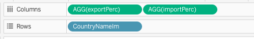
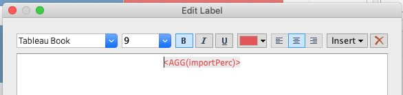

# Interactively visualize export and import in top countries(regions)

In this assignment, data is taken from Department of Statistics to analyze merchandise trade with Singapore by region. Analysis is performed for data obtained from 2011 Jan to 2020 Dec. The goal of the assignment is to interactively visualize the top few countries (number can be defined) in total trading value and the percentile of export and import in each country/region.  

## 1. Original visualization and critics  

### ORIGINAL GRAPH     
  
### CRITIC - CLARITY    
* There is no title or any explanation of when the data was taken. It provides the viewer little context of what the visualization is about. There is also no explanation of what these values represent. They should be stated in the title of the whole graph. 
* There is no explanation on why the countries were chosen. Even though there is a note at the bottom explaining hte net importer and net exporter, no explanation has been made about why these countries/regions are chosen.    
* Axis is not clearly labelled. With background knowledge, I infer that the axis represents percentage. However as it is written in integers from 0 to 80, it is ambiguise if it is referring to dollar value or percentage.In additino, there is no label to the axis.  
* The additional information in the bottom, i.e. “since 2009…..with the United
States since 2006” cannot be visualized in the graph. As the visualization is static, there is no time change incorporated and hence viewers are unable to see trend with time change. In addition, there is no indication of the time in the graph.  
* Source is not clearly stated. Viewers are unable to understand the context of this visualization. It should have been clearly stated where the data is from.

### CRITIC - AESTHETICS 
* The circles are overlapping and overlay on each other, some are completely blocked. It is hard to see all countries/regions. For example, bubble of Korea, Japan and Indonesia are completely overlapping.
* Too many colours. It is unnecessary and distracts viewer’s attention. The colors are not chosen purposely. By different colors, viewers cannot tell what the color means except that they refer to different countries/regions. Too many colors have made the graph messy and not visually appeasing. 
* The icons are too big and not necessary.The icons of "Top net exporter" and "Top net importer" takes up relatively large space, especially if it is compared with the bubble of countries with smaller trade values, such as Thailand and Japan.
* The floating annotation of Mainland China exceeds the graph boundary. The color of it is also too bright and hard to read.
* Many floating annotation blocks the bubble plot, For example, “United States” annotation is on top of bubble of Taiwan and EU.  

## 2. Proposed visualization 
{width=90%}    

### Advantages using proposed plot    
* The visualization has a title to give a context of when the data is taken from and what the graph is about.  
* Source and explanation of the key annotation, such as "net importer", "net exporter", "top net importer", and "top net exporter" is provided.  
* Only 2 colors, blue and red are used to denote export and import. It is easier to interpret.  
* The axixes are labeled and color coded to reflect import and export.  
* It is now an interactive visualization. Viewer can select the year from 2011 to 2020 to see the top N countries/regions by total trade value. Alternatively, user can play to see the trend of change with time.  

### Final interactive visualization    
The visualization can be found [here](https://public.tableau.com/app/profile/xiaozhu.mao/viz/DataViz_assign2/Dashboard1) in Tableau Public.  

## 3. Preparing the visualization with Tableau
### 1) Preparation and import 
1. First import the original data file to Tableau. Drag the table Export to the data panel.As the analysis focuses on trend from 2011 Jan to 2020 Dec, here we are hiding away the data from other time period. Select all data from the first column of date to 2010 Dec->right click->Hide. Do the same for data after 2020 Dec.   
{width=90%}  
{width=80%}   
2. Select all data from 2011 Jan to 2020 Dec->right click->Pivot. This is to reconstruct the table for plotting.  
{width=80%}   
3. Go to the first column "variables" which is the country name, right click->split, to obtain the country short name and the dollars in thousands or millions.  
{width=50%}   
4. Once we have all the columns needed, rename them as shown in the picture to reflect their meanings.  
  
5. Pivoted variables have wrong data types. Change exportDate type to "Date".
  
Similarly, change exportVal type to "Number(decimal)"  
   
6. Drag the "Import" table to connect with "Export" table. Repeat step 1 to 5 for "Import table" and rename the variables as the following.
{width=80%}   
7. Click on Edit filter and add 2 filters to exclude the following in both countryNameEx and countryameIm: Africa, America, Asia, Europe, Ocenia, and total Merchandise Import. This is because these are continent that contains summarized merchandise trading of the countries in the continent. They are not independent trading market to be compared with other countries. 6 values are excluded from each filter.   
{width=80%}   
8. Edit the relation between "Export" and "Import" table by the following 2 fields: time and country name. Country name used here is the 1st split from original variable. Hence it does not contain "(thousands dollars)" in the name.
It is achieved by clicking "Create Relationship Calculation"->type in the formula.  
{width=80%}  
The 2 relationship are as below. Up to this step, we have prepared the data for use in the next stage.  
 

### 2) Calculating new fields and parameters   
1. As some merchandise values are in thousands and some are in millions, these 2 new fileds are calculated to unify all values in export and import.  
  
  
2. Calculate total merchandise value to use for ranking later.  
   
3. Calculate the percentage of export and import over the overall trading value with singapore.  
    
  
4. Based on the percentage, calculate if the "exporter" or "importer". If the export contributes to 50% of the total trade value with Singapore, the country/region is defined as "Exporter". In contrary, if less than 50% of the total trade is from export, the country will be called "Importer".  
  
  
5. Calculate the rank in export and import for each country. This will be used in tooltip for more information.  
  
  
6. Based on ranking in import and export, create a field of top net exporter or top net importer. The number 1 ranked in each will be the top.  
  
  
7. To select top N countries/regions in the total trade values, we first create a parameter from the table. Set the initial value (current) to 5, minimum to 0, maximum to 30 and step size to 5.  
{width=60%}   
8. As there are more countries in Import table than export table, here we are creating a set from Import country names. Note that it is the same in both tables if the country exists in both. This set will be used together with parameter created in step 7 to filter out top N countries.  
{width=70%}   
{width=70%}  

### 3) Plotting the graph   
#### Sheet 1: bubble plot - visualize percentile in all countries at 1 glance  
1. Drag export and import from data pane to column and row individually.   
  
Click on both "export" and "import", go to quick table calculation and change the calculation to "Percentile". Next, change the computing to "by country".  
{width=60%}     
{width=60%}   
2. Next, drag "exportPerc" to Color, so color varies with different import and export percentage.Drag "totalVal" to size to have sizes of circle varies with it. Drag "Country" to details so tableu understands the summation and calculation is based on country. Drag "topNetExporter", "topNetImporter" and "CountryNameIm" to Label. Lastly, drag "import", "export", "exportRank", "importRank", "majorityExport", "majorityImport", "CountryNameIm" to tooltip. They will be used to form a description in each tooltip.   
  
3. Click on "Color"->Edit color. Change palette to "Red-Blue Diverging and set center as 0.5.  
{width=50%}   
Click on "Size"->Edit size. Change size vary to "by range" and adjust the size. Blue is used to represent export and red is to represent import.  
{width=90%}   
Click on "Label"->Text. Insert "topNetExporter","topNetImporter" and "CountryNameIm". Colors are set to blue or red individually to reflect exporter or importer. Tick the box to allow marks over lap with other mark, so when there are more countries to view, all marks can be displayed.  
{width=90%}   
   
In label and tooltip, change the computation to by "country" for "topNetExporter", "topNetImporter","exportRank", and "importRank".  
{width=45%}  {width=45%}    
Right click on "SUM(totalValue)"->format. Under "Pane" section, in dropdown of numbers, select currency custom and choose 1 as decimal space, Billions as display uit. Do the same for other continuous variables, "import" and "export" to be properly displayed in tooltip.  
{width=80%}  
4. Drag "exportDate" to Pages and right click, from the drop down, select discrete "Year". Then select "show filter".  
  
5. Drag "Top N total" to filter. Under parameter, right click on the parameter "totalRank parameter" and select show paramter.  
  
   
{width=50%}    
6. Click on "Tooltip" and inserts values as shown below. Change the color for "majorityExport" and "majorityImport" accordingly so it is colored by export:blue and import:red. Bold all inserted values.   
{width=80%}   
7. Change the title and sheet name by inserting the page name and parameter.SHeet name is changed to "bubble plot".  
{width=80%}    
8. Final view of sheet 1 with graph settings.  
{width=90%}  

#### Sheet 2: line graph - monthly trend of export percentage in each country each year  
1. Drag "exportDate" and "exportPerc" to column and row. Change date to continuous month.   
  
2. Drag "exportPerc" to Color. Click on Color->Edit color and select Red-Blue diverging palette. Set the center to 0.5.  
  
{width=80%}     
3. Right click on the Y axis and select "Add reference line". In the reference line setting, set a constant value of 0.5 and label it as 50%. Under formatting, change it to red dotted line with above filled in blue and bottom filled in red. Blue to indicate export and red to indicate import.    
{width=60%}    
Label the top area as "Exporter" and Bottom area as "Importer" by adding annotation in area. Right click->Format, change the background to None.  
      
  
  
4. The final view of sheet 2, renamed as Line, is shown below.  
{width=90%}  

Next, we will add it to the tool tip. Click tooltip->insert->select line. Change the maxwidth to 300, and maxheight to 200 to fit nicely.  
{width=80%}    
Below shows an example of how tooltip looks like.   
{width=80%}  

#### Sheet 3: histograph - comparing percentage of import and export among countries    
1. Drag "exportPerc", "importPerc", and "CountryNameIm" to columns and rows accordingly.   
{width=60%}   
2. Right click on X axis of "exportPerc" and choose Edit Axis. Change scale to "reversed".  
{width=60%}    
3. Drag "exportPerc" and "importPerc" to label accordingly.  
   
Click on label->Edit label. Change the color to blue for exportPerc and red for importPerc.  
  
  
4. Change color of the histograph. Export: blue; import: red  
     
5. Click on the sort button on top of the histograph in exportPerc pane. It will sort descending by export percentage.   
  
6. Lastly, hide way both X axis and Y axis field label.   
  
7. The whole view of sheet 3, renamed as histograph is shown below.  
{width=90%}   

#### Interactive dashboard    
1. Drag Bubble plot, Histograph to the dashboard. Adjust the position and title. Remove title from histograph as it can be inferred from the color and the overall title. Remove title from bubble plot as it will be replaced by dashboard title. Change the paramter title to "Top N by total trade value". Change year filter title to "Year". Change color legend title to "Export % over total trade value".    
{width=100%}    
2. Add in title by ticking the box of "show dashboard". Add in another explanatory text box and source text box.  
    
{width=80%}    
  
   
3. Adjust the position and the final view of the dashboard is as below:  
{width=100%}  

## 4. Observation  
* From 2011 to 2020, Hong Kong remained to be the top net exporter. The trading amount has increased overall in the past 10 years and the percentage of export remained at around 92%. This is probably due to the fact that Hong Kong is also a trading hub. There is hence a large amount of merchandise traded with Hong Kong.  
* Taiwan remained to be the top net importer since 2013. From 2011 to 2011, United States is the top importer. From 2013 to 2020, United States remained to be the second in importer with Singapore. Semiconductor industry, and information technology are pillar industries of Taiwan. Integrated electronic chips is the top imported merchandise category in Singapore. Considering the distance to Taiwan and diplomatic relationship, this could possibly explain why Taiwan remained to be the top importer for the past 7 years.    
* Malaysia became a net importer in 2019. Since 2011, the percentage of exports with Malaysia has gradually decreased, from 56.56% to 49.68% in 2019. In 2020, it has decreased to 44.37%. The drop may be explained by the influence of Covid-19. Since mid 2020, Malaysia and Singapore border was strictly controlled, which possibly contributes the declining export from Singapore to Malaysia.  
* In 2020, United States became net exporter with 52.77% in export. Until 2019, United states remained to be the top among importers. In 2011 and 2012, it was even top net importer.   
* South Korea became a net exporter in 2017 with exports exceeding imports at 50.86%. The percentage of exports has since increased and reached 51.87% in 2020. Overall, it is still balanced between exports and imports. However, the total trade value with Singapore has been decreasing since 2011. In 2011, total trade value was $47.1 billion dollars. However, in 2020, it has decreased to 44.6 billion dollars.  
* Mainland China was ranked from 2nd to 4th in exports, imports and total trade value until 2013. In 2014, it has jumped to 1st in both imports, exports and total trade value. It remained to be the top since 2014 with a great lead before the country in second place. Even in the middle of Covid-19 in 2020, the total trade value was not reduced. With some research, it is found that in May 2013, Ministry Authority of Singapore opened representative office in Beijing, aiming to strengthen bilateral collaboration and deepen the financial and economic cooperation. This was considered a milestone on Singapore-China collaboration in economy. By end of 2013, according to the statistic research by China, Singapore has become the top exporter to China, with a export value of 66.5B dollars.    
What is observed in the visualization, Mainland China jumping to top 1 in imports, exports and total value in 2014, is possibly the consequence of what happened in 2013. China's lead in trade values before other countries was further enhanced by former president Tony Tan's visit to China and chairman Xi's visit to Singapore, both in 2015. 

reference: (https://www.mas.gov.sg/news/media-releases/2013/mas-opens-representative-office-in-beijing), (https://sgchina30.businesschina.org.sg/a-look-back-on-exchanges.html)


```{r setup, include=FALSE}
knitr::opts_chunk$set(echo = FALSE)
```


