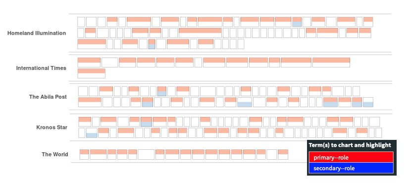
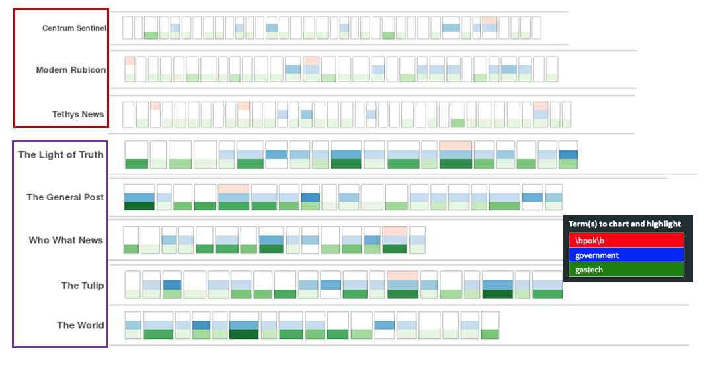
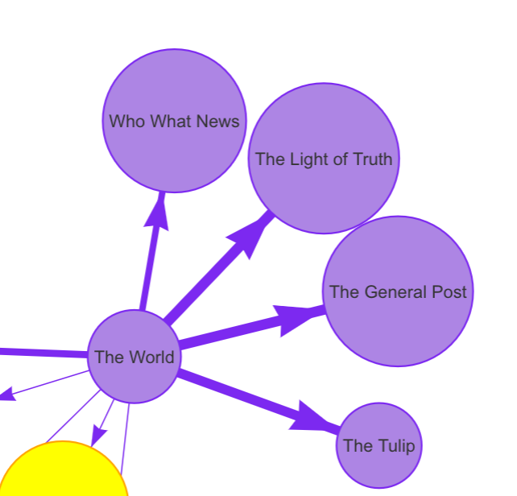
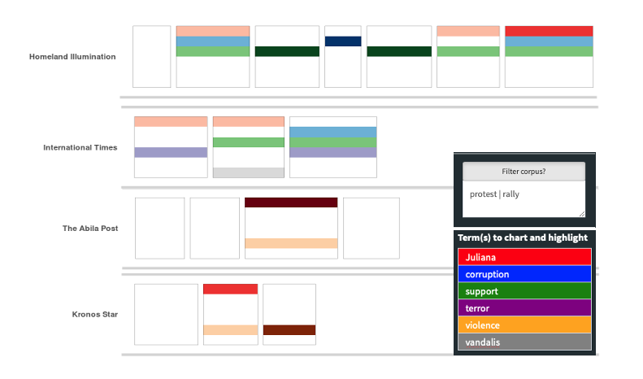
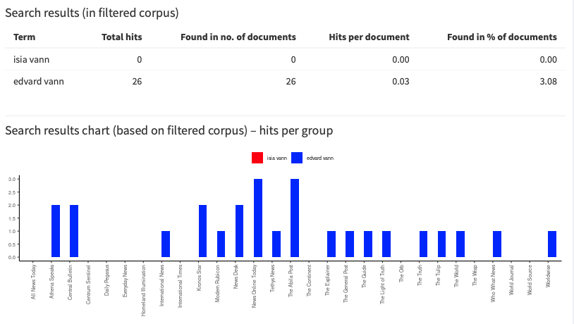

```{r setup, include=FALSE}
knitr::opts_chunk$set(echo=TRUE, message=FALSE, warning=FALSE)
```  


## Literature Review

The Kronos incident was the challenge plot in VAST 2014. The questions were a bit different in 2014 and had a focus on describing the incident timeline. Majority of the candidates use timeline to visualize the progress of the incident. The common questions asked in 2014 and 2021 are connections between POK and GASTech. 

Previous projects use tools, such as python, D3 and Visio to visualize each corpus in a grid with a function to search. Network graphs are commonly used to visualize relationship between personels in GASTech and POK. The approach are effective and will be used in the assignment too, with help of R packages. 

There isn't any high level analysis of the news sources, potentially because the questions did not focus on the sources, rather on the incident. To counter for the difference in questions this year, wordcloud plots will be used (general, comparison and commonality) to gain high level understanding of each news source.


## Loading in packages 

```{r tidy=TRUE}
packages = c('stringr', 'stringi','tidyr','tidyverse', 'dplyr', 'tm', 'lubridate', 
             'corporaexplorer', 'quanteda','quanteda.textstats',"igraph",
             "visNetwork", "tidygraph", "ggraph","networkD3", "stm", 
             "tidytext", "widyr", "wordcloud", 
             "ggwordcloud", "textplot")
for (p in packages){
  if(!require(p, character.only = T)){
    install.packages(p)
  }
  library(p,character.only = T)
}
```  

## Task 1 - characterize data sources, find primary and secondary sources

**Overview:** In this task, all news articles will be loaded in and format in to a data frame. After cleaning, cosine similarity is computed for each pair of articles. Only the top 0.5% pairs with highest similarity will be analyzed here. The threshold cosine similarity is 0.54. It is based on assumption that pairs of article with cosine similarity above the value possess strong similarity. Within each pair, the article published earlier is considered the primary source and the one published later is considered secondary source. This value forms a new column, **"role"**, in the data frame. Each article under the top 0.5% pairs is labeled with the article IDs that are similar to it, both published earlier and later. New column is named as, **"similar_earlier"** and **"similar_later"**. This is to enable easier visualization in the interactive corpus explorer. A interactive directed network graph is used to visualize connections between sources. After adding in new columns, corpus data frame is visualized with corpus explorer with search function. Steps and demonstration are described below.  


### Loading in data  
**1. Get the list of articles in all paper sources**  

```{r warning=FALSE}
list_of_paper <- list.files(path = "data/News Articles", recursive = TRUE,
                            pattern = ".", 
                            full.names = TRUE)
```    

**2. Load in each article in a iterative way and save them into a list of data frames** 

```{r eval=FALSE, warning=FALSE, include=TRUE, tidy=TRUE}
df_list <- list()
num <- 1
for (i in list_of_paper){
  temp <- lapply(i, readLines)
  
  temp <- lapply(1:length(temp),
                 function(j) data.frame(
                   news_no=str_extract(i, "(?<=\\/)\\d+"),
                   rawdata=temp[[j]],
                   stringsAsFactors = FALSE))
  
  df_temp <- do.call(rbind, temp)
  df_temp[,c("type","entry")] <-
    str_trim(str_split_fixed(df_temp$rawdata,":",2))
  
  df_temp <- df_temp[,c("news_no","type","entry")]
  df_temp <- pivot_wider(df_temp, names_from = type, values_from = entry)
  
  df_list[[num]] <- df_temp
  num <- num+1
}
```     

**3. Bind all data frames in the list** 

```{r eval=FALSE, warning=FALSE, include=TRUE}
df <- do.call(rbind.fill,df_list)
```

### Data cleaning and pre-processing  

**1. check data types**  

```{r eval=FALSE, include=FALSE}
glimpse(df)
```  

+ By viewing the column "published", we can see there are 4 types of date. The data type is also not in date. The code chunk below format the dates to a consistent format and converts the data type to date. 

```{r eval=FALSE, warning=FALSE, include=TRUE}
formats <- c("%d %B %Y","%d%B %Y","%B %d, %Y","%Y/%m/%d")
df <-df %>%
  mutate(date = parse_date_time(PUBLISHED, formats))

df$date <- as.Date(as.POSIXct(df$date,tz="GMT"))
``` 

+ For easier ranking, convert Doc_id to int

```{r eval=FALSE, warning=FALSE, include=TRUE}
df$news_no <- as.integer(df$news_no)
```

**2. change column name and adjust column order in order to load to corpus**  

```{r eval=FALSE, warning=FALSE, include=TRUE}
colnames(df) <- c("Doc_id","Source","Title","Published","Location","Text","Author","Note","date")
df_corpus <- df[,c("Doc_id","Text","Source","Title","Author","date","Location","Note")]
```  

**3. This data frame will be used as the main corpus to visualize in corpus explorer. No stopword and punctuation are removed in order to not affect reading. Save the data.**

```{r eval=FALSE, warning=FALSE, include=TRUE}
write_rds(df_corpus, "data/rds/original_corpus")
```

```{r eval=TRUE, warning=FALSE, include=FALSE}
df_corpus <- read_rds("data/rds/original_corpus")
```
### Compute cosine similarity

1. Use package "quanteda" to format corpus into a dfm and clean the corpus by removing stop words and punctuation. Calculate cosine similarity between each pair of document and convert to a data frame. 

```{r warning=FALSE}
news_corpus <- corpus(df_corpus, docid_field="Doc_id", text_field="Text")
clean_corpus <- dfm(news_corpus, remove=stopwords("english"), remove_punct=TRUE)
sim <- textstat_simil(clean_corpus, margin="document", method="cosine")
sim_df <- as.data.frame(sim)
```

+ change type of document1 and document2 to integer

```{r}
sim_df$document1 <- as.integer(as.character(sim_df$document1))
sim_df$document2 <- as.integer(as.character(sim_df$document2))
```

**2. create a table of source for merging later**

```{r}
df_source <- df_corpus %>%
  select(Doc_id,Source,date) 
```

+ Swap doc1 and doc2 id to make doc1 date always earlier than doc2 date. add row id as pair_id, split to 200 bins as ranking based on cosine, highest cosine value indicates highest rank, and highest similarity. 854 pairs are filtered. 

```{r}
sim_tmp <- sim_df %>%
  rowid_to_column(var="pair_id") %>%
  mutate(rank=ntile(cosine,200)) %>%
  filter(rank==200) %>%
  left_join(df_source, by=c("document1"="Doc_id"), suffix=c("1","2")) %>%
  left_join(df_source, by=c("document2"="Doc_id"), suffix=c("1","2")) %>%
  filter(Source1 != Source2) %>%
  filter(date1 != date2) %>%
  transform(document1=ifelse(date1<=date2, document1, document2),
            document2=ifelse(date1<=date2, document2, document1)) %>%
  transform(Source1=ifelse(date1<=date2, Source1, Source2),
            Source2=ifelse(date1<=date2, Source2, Source1))
```

+ since doc 1 is published earlier than doc2, here we assume doc1 is primary news and the matching doc2 is the secondary news. Count the number of primary and secondary news in each news source and label them as primary or secondary. Create a new column, "role", to denote the number of similar documents to the source as primary and secondary source. For example, 4_pri_1_sec means there are 4 similar articles published later than it and 1 similar article published earlier than it. 

```{r echo=TRUE}
df_primary <- sim_tmp %>%
  group_by(document1) %>%
  dplyr::summarise(n = n()) %>%
  mutate(role="primary") 

df_secondary <- sim_tmp %>%
  group_by(document2) %>%
  dplyr::summarise(n = n()) %>%
  mutate(role="secondary") 

#join the new column to df_corpus
df_join <- df_corpus %>%
  left_join(df_primary, by=c("Doc_id"="document1"), suffix=c("_pri","_sec")) %>%
  left_join(df_secondary, by=c("Doc_id"="document2"), suffix=c("_pri","_sec")) %>%
  unite("role", n_pri, role_pri, n_sec, role_sec, sep="_",na.rm=TRUE)

glimpse(df_join)
```

+ From sim_tmp, get all the document IDs that are similar to the source document. "similar_later" are the documents with later published date, "similar_earlier" are the documents with earlier published date. This information will be used to enable easy search and compare of document. The IDs are arranged in the descending order of similarity. For example,123_345_67 are 3 documents with 123 having the strongest similarity to the source. The column is joined back to df_join

```{r echo=TRUE, message=FALSE, warning=FALSE}
pair_pri <- sim_tmp %>%
  select(cosine,pair_id,document1,document2) %>%
  group_by(document1) %>%
  arrange(document1,desc(cosine)) %>%
  dplyr::summarize(similar_later=paste(document2, collapse="_"))

pair_sec <- sim_tmp %>%
  select(cosine,pair_id,document1,document2) %>%
  group_by(document2) %>%
  arrange(document2,desc(cosine)) %>%
  dplyr::summarize(similar_earlier=paste(document1, collapse="_"))

#join the column to df_join
df_join <- df_join %>%
  left_join(pair_pri, by=c("Doc_id"="document1")) %>%
  left_join(pair_sec, by=c("Doc_id"="document2"))

glimpse(df_join)
```

### Visualization and analysis  

#### Corporaexplore to visualize all documents  

Corpus explorer is used to visualize each document with the metadata, doc_id, title, author, date, location, role, similar document published later than it, and similar document published earlier than it. The main usage is achieved by searching keyword.
```{r eval=FALSE, message=FALSE, warning=FALSE, include=FALSE}
dashboard <- prepare_data(
  dataset = df_join,
  date_based_corpus = FALSE,
  columns_doc_info=c("Doc_id","Title","Author", "date", "Location",
                     "role","similar_later", "similar_earlier"),
  grouping_variable = "Source")

saveRDS(dashboard, "./dashboard/corpus_dashboard.rds", compress = FALSE)
```

```{r eval=FALSE, include=FALSE}
#deploy app to shiny.io
library(rsconnect)
rsconnect::deployApp('/Users/xiaozhumao/XiaozhuM/DataViz_blog/_posts/2021-07-03-assignmentmc1/dashboard')
```

The shiny app is first deplyed to shiny.io and then embedded in the R markdown. For full view, please click [here](https://xiaozhumao.shinyapps.io/dashboard/) to view the  app in a browser.  

<iframe src=" https://xiaozhumao.shinyapps.io/dashboard/"
style="border: 1px solid black; width: 100%; height: 500px;"></iframe>  

Searching primary and secondary in the column "role" that was previously created, there are 5 outstanding sources with significantly more articles as primary than as secondary. These are the primary sources identified. 


#### Interactive network graph  

Network graph is used to visualize the clusters surrounding these sources. Prepare nodes and edges for all sources to identify the neighboring nodes of the primary sources. Then they are labeled with groups. 

```{r warning=FALSE, include=FALSE}
sim_nodes <- df_source %>%
  group_by(Source) %>%
  summarise(value=n()) %>%
  rename(label=Source) %>%
  rowid_to_column("id") %>%
  mutate(title=paste("<p>",label,"<br>",value,"documents in total</p>",sep=" ")) 
  
sim_edges <- sim_tmp %>%
  group_by(Source1, Source2) %>% 
  summarise(value=n()) %>%
  left_join(sim_nodes, by=c("Source1"="label")) %>%
  rename(from=id) %>%
  left_join(sim_nodes, by=c("Source2"="label")) %>%
  rename(to=id) %>%
  select(from, to, value.x,Source1, Source2) %>%
  rename(value=value.x) %>%
  mutate(title=paste("<p>Similar Articles<br>primary:",Source1, "</br>",
                     "<br>secondary:",Source2,"</br>",
                     value,"similar documents</p>", sep=" ")) %>%
  select(Source1, Source2, from, to, value, title)
  
```

```{r echo=FALSE, warning=FALSE}
sim_nodes2 <- sim_nodes %>%
  mutate(group=ifelse(label %in% c("Homeland Illumination","All News Today", 
                                   "The Wrap", "Daily Pegasus","The Orb"),
                      "HI",
               ifelse(label %in% c("International Times","World Journal", 
                                   "World Source","The Continent", "Everyday News"),
                      "IT",
               ifelse(label %in% c("The World","The Tulip", "The Light of Truth", 
                                   "Who What News", "The General Post"),
                      "TW",
               ifelse(label %in% c("The Abila Post","Central Bulletin", 
                                   "The Explainer","Athena Speaks","News Desk"),
                      "TAP",
               ifelse(label %in% c("Kronos Star","The Guide", "The Truth",
                                   "International News","Worldwise", 
                                   "News Online Today"),
                      "KS",
                      "independant"))))))

```

```{r echo=FALSE, warning=FALSE}
sim_edges2 <- sim_tmp %>%
  filter(Source1 %in% c("Homeland Illumination", "International Times",
                        "The World", "The Abila Post", "Kronos Star")) %>%
  group_by(Source1, Source2) %>% 
  summarise(value=n()) %>%
  left_join(sim_nodes, by=c("Source1"="label")) %>%
  rename(from=id) %>%
  left_join(sim_nodes, by=c("Source2"="label")) %>%
  rename(to=id) %>%
  select(from, to, value.x,Source1, Source2) %>%
  rename(value=value.x) %>%
  mutate(title=paste("<p>Similar Articles<br>primary:",Source1, "</br>",
                     "<br>secondary:",Source2,"</br>",
                     value,"similar documents</p>", sep=" ")) %>%
  select(Source1, Source2, from, to, value, title)

```

```{r echo=FALSE, warning=FALSE}
visNetwork(sim_nodes2, sim_edges2) %>%
  visNodes(shape="circle") %>%
  visEdges(arrows = 'to') %>%
  visOptions(highlightNearest = TRUE, nodesIdSelection = TRUE) %>%
  visLegend() %>%
  visIgraphLayout(layout="layout_nicely")
```

Heatmap to visualize the pairwise similarity
```{r echo=FALSE, warning=FALSE}
sim_tmp %>%
  group_by(Source1, Source2) %>%
  summarise(score=mean(cosine)) %>%
  arrange(desc(score)) %>%
  ggplot(aes(Source1, Source2, fill=score)) + geom_tile()+
  scale_fill_gradient(low="white", high="red")+
  theme(axis.text.x = element_text(angle=45, hjust=1))
```

#### Conclusion 
There are 5 primary news sources, namely "Homeland Illumination", "International Times", "The Abila Post", "Kronos Star" and "The World". They are in the center of each community in the above graph with outward pointing arrows. The arrow is from primary to secondary sources. The width of each edge indicates the number of similar articles between primary and secondary. The heatmap above plots the average cosine similarity between each pair. The highest is seen in "Homeland Illumination-All News Today", "Internal Times-World Source", "Kronos Star-International News", "The Abila Post-Central bulletin", and "The World-Who What News". This corroborate that the 5 sources are indeed primary sources. The other news sources mostly re-post or report based on the primary sources. 

It is also to be noted there are 3 sources rather independent, "Tethys News", "Centrum Centinal", "Modern Rubicon". Their articles are not tagged with any similar articles with similarity more than 0.54. 

Another source to pay attention to is "News Online Today". It has the most number of articles, 111. Their article content is similar to all other primary sources, i.e. edges pointing to "News Online Today" with weights of 10 to 22 respectively. It reports from mixed sources which enables it to have a balanced point of view. 

## Task 2 - Characterize news sources to find any bias

**Overview**: Corpus explorer from Task 1 will be used again to view each text. By searching for key terms, "POK", "APA", "government", and "GASTech", we aim to find out if there is any bias held against these terms in each day source. Additionally, word cloud is plotted for each source to find frequently appeared words. Analysis will be conducted in news source clusters found from previous task. 

From the background information, we understand that **POK(protectors of kronos)** was established to advocate environmental protection in Kronos. A key incident in the growth of POK was death of Juliana Vann, a 10-year-old girl who died from leukemia, directly or indirectly resulted from water pollution. Water pollution was contributed mostly by **GASTech** factory in Kronos. 

In general, POK is against GASTech and Kronos government did little to help with the water pollution. Because POK is clearly on the opposite side of government and GASTech, in exploring the corpus, we filter out 2 kinds of news:

+ those mention both POK and government  
+ those mention both POK and GASTech  

By analysing these texts, we aim to find opinions held by news sources.

### Corpus Explorer

The shiny app is from previous section.  Search for POK (in red), government (in blue) and gastech (in green) to highlight in corpus.

This shows a distribution of occurences of keywords in each news source.
  

### Group 1: **The Disinterested**

From the plot, clearly there is barely no mentioning of POK in _Centrum Sentinel, Modern Rubicon, Tethys News, The General Post, The light of Truth, The Tulip, The World, and Who What News._ These sources tend to report more on GASTech with some news on government. From previous network visualization, we can also find that they exclusively belong to 2 groups, *independent* circled in red or news sources surrounding *The World* circled in purple.  

From corpus explorer and the datatable below, we can conclude that _Centrum Sentinel, Modern Rubicon, Tethys News_ report updates on the kidnap incident with timestamp. They only focus on reporting the incident. The time of posts ranges across 2 days from Jan 20 to Jan 21, 2014. Next, we obtain details from searching pok in the datatable.

+ It can be concluded that article in Modern Rubicon is inferring that POK is the kidnapper and demanded for ransom of 20 million dollars. _"1245 - I REDEEM DEMANDS FROM POK - the protections of Kronos has freed a supporting responsibility of declaration of the kidnapping of employs you of GAStech that they demand I redeem $20 million"_

+ The only article mentioning POK is from Petrus Gerhard, mentioning that POK is trying to communicate without hinderance from the government. It suggests a neutral-pro POK stand of the paper. _"The POK is forced in order to go to the great lengths in order to communicate with you without obstacle from the government"_

+ in Tethys News, articles are reporting the facts happening and in a rather neutral stand. _"We have not received the information in a position to confirming the role of the POK in this kidnapping declared, but we notice that they are develops more and more violent in these last 5 years."_

```{r warning=FALSE, include=FALSE}
df_join %>%
  filter(Source %in% c("Centrum Sentinel", "Modern Rubicon", "Tethys News")) %>%
  select(Source, date, Text) %>%
  DT::datatable(filter="top",
              rownames=FALSE,
              options = list(pageLength = 5, autoWidth = FALSE))
```

{width=60%}  
As the other 5 sources have a centroid, "The World", a wordcloud is plot to visualize topics involved in the texts.

```{r warning=FALSE, include=FALSE}
word_freq <- df_join %>% #base word frequencies for all words
  select(Source, Text) %>%
  unnest_tokens(Word, Text) %>%
  filter(str_detect(Word, "[a-z']$"))%>%
  count(Source, Word, sort=TRUE) %>%
  ungroup()
```

```{r echo=FALSE}
par(mar=rep(0,4)) #remove remove margin
stop <- c(stop_words$word)

word_freq %>% 
  filter(Source == "The World",
         !Word %in% stop) %>% 
  with(wordcloud(Word, n, min.freq = 2,
                 max.words=100, random.order=FALSE, rot.per=0.35, 
                 colors=brewer.pal(8, "Dark2")))
```

The outstanding keywords are "Gastech", "Government", "International", "Kronos", "Sanjorge". These are neutral words indicating that sources clustered with The World discusses news about Gastech and government in a neutral tone. Additionally, it is a business oriented group of news sources with less focus on politics. "Contamination" is a frequent word too. This is associated with the accusation from POK for polluting the water. However, a major incident in POK's history which is related to water pollution, Juliana Vann's death was not mentioned here. This indicates that The World is not telling stories from the POK's point of view. Instead, it holds a rather neutral stand. 

```{r echo=FALSE}
df_join %>%
  filter(Source %in% c("The World")) %>%
  select(Title, date, Text) %>%
  separate_rows(Text, sep ="\\.") %>%
  DT::datatable(filter="top",
              rownames=FALSE,
              options = list(pageLength = 5, autoWidth = FALSE))
```

### Group 2: **The Extreme** 

Filtering out documents with keyword "protest" and "rally". Keywords Juliana, corruption, support are assumed to be used more often for POK inclined sources, as these are usually the topic in their activities. On the other hand, terror, violence and vandalism are considered more government inclined, as these are usually how they see POK. 

+ Government inclined keywords did not appear at all in Homeland Illumination. It also has the most articles about protest and rally.
+ International Times have articles with both types of keywords
+ In The Abila Post, it was in a neutral and calming tone when mentioning the rally, _"The anniversary of his death, June 19, has seen additional protests, demonstrations, riots, and violence._ 
+ Kronos Star refer to POK's protest as violence. I.e. Kronos Star has quoted president Kapelou regarding the rally _"This sort of violence will not be condoned. Destruction and violence is no way to achieve peace and change - these things are in opposition to each other. The Protectors of Kronos must resume peaceful means; all other approaches are unjustifiable."_ 

From the above, we can preliminarily draw conclusion that Homeland Illumination is more biased towards POK and Kronos Star is more inclined to the government. A comparison wordcloud and commonality wordcloud is plotted to further analyze the two primary news source.



Comparison and Commonality wordcloud between the Homeland Illumination and Kronos Star

```{r comparison, echo=FALSE, message=FALSE, warning=FALSE}
set.seed(2021)

par(mar=rep(0,4), #remove remove margin
    mfrow=c(1,2))
#define a list of word with strong emotions based on the background
stop <- c(stop_words$word, "pm", "update")

compare_freq <- word_freq %>%
  filter(!Word %in% stop) %>%
  filter(Source %in% c("Homeland Illumination", "Kronos Star")) %>%
  pivot_wider(names_from="Source", values_from="n") %>%
  replace_na(list(`Homeland Illumination`=0, `Kronos Star`=0)) %>%
  column_to_rownames(var="Word")

comparison.cloud(compare_freq,title.size=1, max.words=100, 
                 random.order=FALSE, scale=c(2,0.3), rot.per=0.35)

commonality.cloud(compare_freq, max.words=100, 
                 random.order=FALSE, scale=c(2,0.3), rot.per=0.35, 
                 color=brewer.pal(8, "Dark2"))
```
From the comparison, we can conclude that indeed Kronos Star is more a voice of the government, with a lot of mentioning of police; president; Kapelou, who is the new Kronos President; building, which refers to the Abila Capital Bulding where protests happened. Whereas in Homeland Illumination, keywords are elian, henk, karel, bodrogi who are leaders of POK; death, water, wellness, river which are the main motives of POK. It is also to note that in the comparison graph, Kronos Star mentions violence and security, wich do not appear in Homeland Illumination.

Both mention gastech, kronos, pok, government, health. It means that the 2 sources are likely to discuss about the same topics but from different perspective. Further supporting evidence can be checked with interactive data table.

As POK is against GASTech, we are keen to find out their view on POK's celebration on 21st Jan by searching celebrate in Text and limit the Source to Homeland Illumination and Kronos Star.

+ In Homeland Illumination, the celebration is depicted as _"unfettered kleptocracy that has kept Kronos public officials in mansions and luxury vehicles"_
+ In Kronos Star, it is described as _"celebrate the 20th year of cooperation between the corporation and our country"_ and President Kapelou hosted the reception.

The above supported the point that Homeland Illumination is a voice of POK while Kronos Star is more inclined to the government and government-GASTech colaboration.

```{r echo=FALSE}
df_sentence <- df_join %>%
  separate_rows(Text, sep="[.]") %>%
  select(Source, Text) %>%
  mutate(Text=str_trim(Text))

DT::datatable(df_sentence, filter="top",
              rownames=FALSE,
              options = list(pageLength = 3, autoWidth = FALSE))
```
Another incident to differentiate the views of the two sources is Elian Karel's death. The breakdown sentences shows that:
+ Homeland Illumination is in a supportive role of POK. Some sentences such as, _"Elian Karel, age 28, died Friday while unlawfully incarcerated at the Abila City Prison"_ in one of the articles showed sympathy for the POK leader's death in prison. 
+ Kronos Star described it as _"Elian Karel, who died of natural causes in jail last year"_ which shows no sympathy.
+ The Abila Post is in favor of POK on Elian's death by portraying him as _"The POK's second major martyr is Elian Karel, who died in 2009 while incarcerated of undetermined causes"_
+ International Times has a neutral stand on Elian's death and describe him as _"Voice of protest for some, popularist demagogue for others, Protectors of Kronos leader Elian Karel became a martyr and a rallying point for some; a figure of disdain and rabblerousing for others, and a political concern to the Kronosian government"_

### Group 3: **The neutral** 

Comparison and Commonality wordcloud between the Abila Post and International Times

```{r echo=FALSE}
set.seed(2021)

par(mar=rep(0,4), #remove remove margin
    mfrow=c(1,2))
#define a list of word with strong emotions based on the background
stop <- c(stop_words$word, "pm", "update")

compare_freq <- word_freq %>%
  filter(!Word %in% stop) %>%
  filter(Source %in% c("The Abila Post", "International Times")) %>%
  pivot_wider(names_from="Source", values_from="n") %>%
  replace_na(list(`The Abila Post`=0, `International Times`=0)) %>%
  column_to_rownames(var="Word")

comparison.cloud(compare_freq, title.size=1, max.words=100, 
                 random.order=FALSE, scale=c(2,0.3), rot.per=0.35)

commonality.cloud(compare_freq, max.words=100, 
                 random.order=FALSE, scale=c(2,0.3), rot.per=0.35, 
                 color=brewer.pal(8, "Dark2"))
```
Even though both reported news on gastech, kronos, government, pok and gastech CEP Sanjorge, there is significantly more mentioning of GASTech, Kronos in The Abila Post than in the International Times. Kapelou, the Kronos President also appears frequently in the Abila Post. It is probably because The Abila Post is a local paper and International Times reports global issues, as hinted by their names.

### Conclusion
News Sources are analyzed by clusters. The bias is annotaed and grouped. 
```{r include=FALSE}
sim_nodes3 <- sim_nodes2 %>%
  mutate(group=ifelse(group=="HI", "Pro-POK",
              ifelse(group=="TAP","Neutral-POK",
              ifelse(group=="IT", "Neutral",
              ifelse(group=="KS", "Pro-GOVT",
              ifelse(group=="TW", "Business", "Netral-GOVT"))))))
```
```{r echo=FALSE}
visNetwork(sim_nodes3, sim_edges2) %>%
  visNodes(shape="circle") %>%
  visEdges(arrows = 'to') %>%
  visOptions(highlightNearest = TRUE, nodesIdSelection = TRUE) %>%
  visLegend() %>%
  visIgraphLayout(layout="layout_nicely")
```

## Task 3 - Find relationship between personal and organizations

### Loading in package and data  

install chorddiag and load library. Chord diagram will be used to analyze email conversation between employees.

```{r}
devtools::install_github("mattflor/chorddiag")
library(chorddiag)
```

Read in employee records to form nodes. Format the columns of dates to date format. A new column "Name" is created to replace FirstName and LastName. Column "Age" is created from BirthDate. Age is calculated until 2014 when the kidnap incident happened. 

```{r message=FALSE}
employee_records <- read_csv("data/EmployeeRecords.csv")
employee_records <- employee_records %>%
  mutate(Name=paste(FirstName, LastName, sep=".")) %>%
  transform(Name=sub(" ", ".", Name)) %>%
  transform(BirthDate=parse_date_time(BirthDate,"%d/%m/%y"),
            CitizenshipStartDate=parse_date_time(CitizenshipStartDate, "%d/%m/%y"),
            PassportIssueDate=parse_date_time(PassportIssueDate, "%d/%m/%y"),
            PassportExpirationDate=parse_date_time(PassportExpirationDate,
                                                   "%d/%m/%y"),
            CurrentEmploymentStartDate=parse_date_time(CurrentEmploymentStartDate,
                                                       "%d/%m/%y"),
            MilitaryDischargeDate=year(parse_date_time(MilitaryDischargeDate,
                                                  "%d/%m/%y"))) %>%
  mutate(Age=ifelse(year(BirthDate)>2014, 
                             2014-year(BirthDate)+100, 2014-year(BirthDate))) %>%
  select(Name, Age,everything(), -FirstName, -LastName, -BirthDate)
```

Make row id a new column "id" as the node id. Name is the node label. Rename some columns for easier understanding.

```{r}
employee_nodes <- employee_records %>%
  select(Name,Gender,Age,CurrentEmploymentType,CurrentEmploymentTitle,
         CitizenshipCountry) %>%
  rename(label=Name, Department=CurrentEmploymentType,
         Title=CurrentEmploymentTitle, Country=CitizenshipCountry) %>%
  arrange(label) %>%
  rowid_to_column("id")
```

Load in edges list from email headers. Separate SentDate and SentTime. Because all emails were sent in 2014 Jan, additional column is created for day of month. This will be used to visualize the number of emails in each day by each sender, considering a email will be sent to multiple receiver. Another column, "Role", is created to indicate if the email is a direct email or reply to other emails.

```{r}
employee_email <- read.csv("data/email headers.csv", encoding="UTF-8")
employee_email_agg <- employee_email %>%
  transform(Subject=stringi::stri_enc_toascii(Subject)) %>%
  separate_rows(To, sep=",") %>%
  separate(From, c("From","FromEmail"), sep="@") %>%
  separate(To, c("To","ToEmail"), sep="@") %>%
  mutate(To=str_trim(To)) %>%
  transform(Date=parse_date_time(Date, c("mdy_hm","mdy"))) %>%
  transform(SentDate=date(Date),
            SentTime=format(Date, format="%H:%M")) %>%
  mutate(Type=ifelse(str_detect(Subject, "RE:")==TRUE, "reply","direct")) %>%
  select(From, To, SentDate, SentTime, Type, Subject) %>%
  rename(Source=From, Target=To) %>%
  transform(Source=sub(" ", ".", Source),
            Target=sub(" ", ".", Target))
```

### Visualization and analysis  

#### Interactive tabel - Manipulate table to find insights

Manipulate table to detect any employee who sends email to all employees, i.e. send to 53 recipients excluding himself or herself. Group the records by source, day, type, subject. The table below indicates that only 2 people who send to the whole company, Mat Bramar and Ruscella Mies Haber. They both work in administration department. Mat is assistant to CEO. From the subjects, we can conlude that he regularly sends announcement, reminders, and matters that relate to the whole company, such as "All staff announcement" and "Changes to travel policy".

Ruscella is assistant to engineering group manager. She sends only 2 types of emails to the whole company, "Daily morning announcements" and "Good morning, GasTech!" Both are daily news updates for the whole company to read. 

```{r echo=FALSE, message=FALSE}
email_eachday <- employee_email_agg %>%
  filter(Source!=Target) %>%
  group_by(Source, SentDate, Type, Subject) %>%
  summarise(n=n()) %>%
  filter(n==53) %>%
  select(Source, SentDate, Subject) %>%
  arrange(Source,Subject)

DT::datatable(email_eachday, filter="top",
              caption= htmltools::tags$caption(
                style = 'caption-side: top; text-align: left;', 
                htmltools::em("Employee who sent emails to the whole company")),
              rownames=FALSE,
              options = list(pageLength = 7, autoWidth = FALSE))
```

Next, we will remove such exchanges that were sent to all employees for better interpretation of the emails. This includes both directed email and reply emails to all. 

```{r echo=FALSE}
employee_email_agg2 <- email_eachday %>%
  mutate(delete="yes") %>% #mark all emails in email_eachday as "yes" in delete
  right_join(employee_email_agg, by=c("Source"="Source",
                                      "Subject"="Subject",
                                      "Type"="Type",
                                      "SentDate"="SentDate")) %>%
  filter(is.na(delete)) %>% #only keep those without a lable in delete
  filter(Source!=Target) %>%
  select(Source, Target, SentDate, SentTime, Subject, Type)
```

#### Interactive network 

Prepare nodes and edges table for visNetwork. 

```{r}
employee_nodes <- employee_nodes %>%
  #add tooltip column
  mutate(title=paste("<p>",label,Gender,Age,"</br>",
                     "<br>",Department, Title,"</br></p>",sep=" ")) %>%
  rename(group=Department)
```

```{r echo=FALSE}
employee_edges <- employee_email_agg2 %>%
  left_join(employee_nodes%>%select(id,label),
            by=c("Source"="label"), suffix=c(".Source", ".Target")) %>%
  left_join(employee_nodes%>%select(id,label),
            by=c("Target"="label"), suffix=c(".Source", ".Target")) %>%
  rename(from=id.Source, to=id.Target) %>%
  group_by(from, to, Source, Target, Type) %>%
  summarise(Sum=n()) %>%
  ungroup() %>%
  group_by(from, to, Source, Target) %>%
  mutate(value=sum(Sum)) %>%
  mutate(Tooltip=paste(Sum, Type)) %>%
  select(-Sum, -Type) %>%
  mutate(Tooltip=paste(Tooltip, collapse=", ")) %>%
  mutate(title=paste("<p>from",Source,"to",Target, "</br>",
                     Tooltip, "</br>")) %>%
  ungroup() %>%
  distinct(from, to, value, title)
```  

```{r}
visNetwork(employee_nodes, employee_edges) %>%
  visEdges(arrows = 'to', ) %>%
  visOptions(highlightNearest = TRUE, nodesIdSelection = TRUE) %>%
  visLegend() %>%
  visIgraphLayout(layout="layout_with_fr")

```

Visualize together with interactive table of all emails.

```{r echo=FALSE}
DT::datatable(employee_email_agg2, filter="top",
              caption= htmltools::tags$caption(
                style = 'caption-side: top; text-align: left;', 
                htmltools::em("Email exchanges that are not to everyone")),
              rownames=FALSE,
              options = list(pageLength = 5, autoWidth = FALSE))
```
#### Findings and conclusion
From the background information, we know that the founding leaders of POK are Henk Bodrogi, Jeroen Karel, Carmine Osvaldo and the current leaders are Elian Karel, Silvia Marek, Mandor Vann, Isia Vann, Lucio Jakab, Lorenzo Di Stefano, Valentine Mies, Yanick Cato and Joreto Katell.

There are 7 employees with the same last name of middle name as the POK leaders. 5 of them are in securities and 1 of them is the truck driver. The combination enables them to conveniently bring in suspected people or bring out people sneakily.   

Below network graph shows email converstation initiated by these members.

```{r}
name <- "Bodrogi|Karel|Osvaldo|Marek|Vann|Jakab|Stefano|Mies|Cato|Katell"

employee_nodes_suspect <- employee_nodes %>%
  filter(str_detect(label, name))
```

```{r echo=FALSE}
employee_edges_suspect <- employee_email_agg2 %>%
  right_join(employee_nodes_suspect%>%select(id,label),
            by=c("Source"="label"), suffix=c(".Source", ".Target")) %>%
  left_join(employee_nodes%>%select(id,label),
            by=c("Target"="label"), suffix=c(".Source", ".Target")) %>%
  rename(from=id.Source, to=id.Target) %>%
  group_by(from, to, Source, Target, Type) %>%
  summarise(Sum=n()) %>%
  ungroup() %>%
  group_by(from, to, Source, Target) %>%
  mutate(value=sum(Sum)) %>%
  mutate(Tooltip=paste(Sum, Type)) %>%
  select(-Sum, -Type) %>%
  mutate(Tooltip=paste(Tooltip, collapse=", ")) %>%
  mutate(title=paste("<p>from",Source,"to",Target, "</br>",
                     Tooltip, "</br>")) %>%
  ungroup() %>%
  distinct(from, to, value, title)
```  

```{r echo=FALSE}
visNetwork(employee_nodes, employee_edges_suspect) %>%
  visEdges(arrows = 'to', ) %>%
  visOptions(highlightNearest = TRUE, nodesIdSelection = TRUE) %>%
  visLegend() %>%
  visIgraphLayout(layout="layout_nicely")

```

The network graph below shows the email conversation to these group of people. 

```{r echo=FALSE}
employee_edges_suspect2 <- employee_email_agg2 %>%
  left_join(employee_nodes%>%select(id,label),
            by=c("Source"="label"), suffix=c(".Source", ".Target")) %>%
  right_join(employee_nodes_suspect%>%select(id,label),
            by=c("Target"="label"), suffix=c(".Source", ".Target")) %>%
  rename(from=id.Source, to=id.Target) %>%
  group_by(from, to, Source, Target, Type) %>%
  summarise(Sum=n()) %>%
  ungroup() %>%
  group_by(from, to, Source, Target) %>%
  mutate(value=sum(Sum)) %>%
  mutate(Tooltip=paste(Sum, Type)) %>%
  select(-Sum, -Type) %>%
  mutate(Tooltip=paste(Tooltip, collapse=", ")) %>%
  mutate(title=paste("<p>from",Source,"to",Target, "</br>",
                     Tooltip, "</br>")) %>%
  ungroup() %>%
  distinct(from, to, value, title)
```  

```{r echo=FALSE}
visNetwork(employee_nodes, employee_edges_suspect2) %>%
  visEdges(arrows = 'to', ) %>%
  visOptions(highlightNearest = TRUE, nodesIdSelection = TRUE) %>%
  visLegend() %>%
  visIgraphLayout(layout="layout_nicely")

```


+ They have emails sent to people outside of the department, especially Henk Mies, sent an email to CEO, named as "File attachment" on 17th Jan. There is no other email communication between them. Considering Henk Mies is a truck driver, there is unlikely that he has any crossover in work with the CEO.

```{r echo=FALSE}
employee_email_agg2 %>%
  filter(Source %in% c("Henk.Mies","Sten.Sanjorge.Jr."),
         Target %in% c("Henk.Mies","Sten.Sanjorge.Jr.")) %>%
  DT::datatable(filter="top", caption= htmltools::tags$caption(
                style = 'caption-side: top; text-align: left;', 
                htmltools::em("Emails among suspected people")),
              rownames=FALSE,
              options = list(pageLength = 5, autoWidth = FALSE))
```

+ Ruscella Mies Haber has sent emails to Minke Mies who is outside of the department about "FW: ARISE - Inspiration for Defenders of Kronos". The title contains defenders of kronos, which is similar to Protectors of Kronos. Checking the people involved in the email, surprisingly most of them, Ruscella Mies Haber, Loreto Bodrogi, Isia Vann, Hennie Osvaldo, Minke Mies are having the same sir names as the POK leaders. There is potentially a small POK branch in GASTech. Rachel Pantanal and Inga Ferro, though not directly related to the POK leadrs, potentially are in the group too. Especially considering that Rachel Pantanal was the one initiating the email. 

+ "Arise" in the email title, is also a magazine that APA sought to build brand through. There might be a link between the email and the Arise magazine. _"In recent years the APA has sought to build their brand through websites and the publication of a professional, high-quality magazine called "Arise"."_ (from International Times)

```{r echo=FALSE}
employee_email_agg2 %>%
  filter(str_detect(Subject, "Defenders of Kronos")) %>%
  DT::datatable(filter="top", caption= htmltools::tags$caption(
                style = 'caption-side: top; text-align: left;', 
                htmltools::em("Emails of defenders of Kronos")),
              rownames=FALSE,
              options = list(pageLength = 5, autoWidth = FALSE))
```

+ Looking at emails from Isia Vann, there are 6 emails sent to Rachel Pantanal and 2 replied from Rachel. Isia is 28 and Rachel is 30. And all of the emails are non work related, including weekend data invite, karaoke, gyro place, flowers. This suggest that they are having a romantic relationship. 

```{r echo=FALSE}
employee_email_agg2 %>%
  filter(Source %in% c("Isia.Vann", "Rachel.Pantanal"),
         Target %in% c("Isia.Vann", "Rachel.Pantanal")) %>%
  DT::datatable(filter="top", caption= htmltools::tags$caption(
                style = 'caption-side: top; text-align: left;', 
                htmltools::em("Emails between Isia Vann and Rachel Pantanal")),
              rownames=FALSE,
              options = list(pageLength = 5, autoWidth = FALSE))
```

+ Isia Vann, who has the exact same name as POK leader was in ArmedForcesOfKronos and was discharged in 2007. His resume has stated he was in army from 2005 to 2007. Despite having the same name as POK leader, he was not questioned by the police after the incident. Instead, Edvard Vann was in investigation with the police for 6 hours. _"Edvard Vann, a GAStech - Kronos security guard who was interrogated and released after 6 hours"_ (from The Abila Post) 

This can be explained by either 1) He was kidnapped during the incident 2) He was in great disguise and the Police was not aware that he was GASTech employee.

7 other people are identified as potential acquaintance of Isia Vann, by filtering out their military discharge year from 2005 to 2009 assuming their military service time is 2 years. However, there is no evidence of email exchange between Isia Vann and these people. Among these people, the most potential person is Albina Hafon who was in army from 2006 to 2007 with 1 year overlap with Isia Vann. He attended ABila Community college from 2004 to 2006 which also overlaps with Isia Vann who was in the same college from 2003 to 2005.


```{r echo=FALSE}
employee_records %>%
  filter(MilitaryServiceBranch=="ArmedForcesOfKronos",
         MilitaryDischargeDate >= 2005 & MilitaryDischargeDate <= 2009) %>%
  select(Name, Age, Gender, MilitaryDischargeDate) %>%
  arrange(MilitaryDischargeDate) %>%
  DT::datatable(filter="top", caption= htmltools::tags$caption(
                style = 'caption-side: top; text-align: left;', 
                htmltools::em("People who might have been in the army with Isia Vann")),
              rownames=FALSE,
              options = list(pageLength = 5, autoWidth = FALSE))
```


+ Vincent Kapelou is the nephew of Kronos President. _"ABILA, Kronos - letters claimed to be from guards of Kronos (POK) were received by Vincent Kapelou, minister of health and nephew of President Kapelou. "_ (from The Abila Post)

+ Mandor Vann from POK has potential relationship with APA, The Asterian people's Army as _"he spent much of his military career serving at the Kronosian embassies in Tethys and Asteria"_ (from 5 year report)

