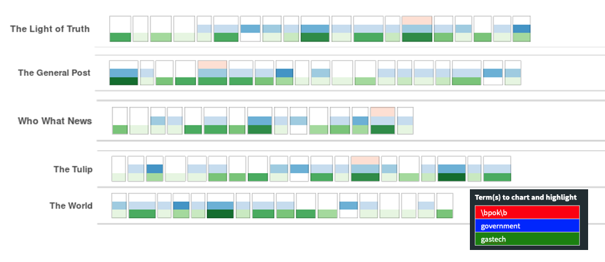

```{r include=FALSE}
def.chunk.hook  <- knitr::knit_hooks$get("chunk")
knitr::knit_hooks$set(chunk = function(x, options) {
  x <- def.chunk.hook(x, options)
  ifelse(options$size != "normalsize", paste0("\n \\", options$size,"\n\n", x, "\n\n \\normalsize"), x)})
```

```{r setup, include=FALSE}
knitr::opts_chunk$set(echo=TRUE, message=FALSE, warning=FALSE)
```  

## Loading in packages 

The packages will be used in the assignment. 

```{r tidy=TRUE}
packages = c('stringr', 'stringi','tidyr','tidyverse', 'dplyr', 'tm', 'lubridate', 
             'corporaexplorer', 'quanteda','quanteda.textstats',"igraph",
             "visNetwork", "tidygraph", "ggraph","networkD3", "stm", 
             "tidytext", "widyr", "wordcloud", 
             "ggwordcloud", "textplot")
for (p in packages){
  if(!require(p, character.only = T)){
    install.packages(p)
  }
  library(p,character.only = T)
}
```  

## Task 1 - characterize data sources, find primary and secondary sources

**Overview:** In this task, all news articles will be loaded in and format in to a data frame. After cleaning, some features, cosine similarity is computed for each pair of articles. Only the top 0.5% pairs with highest similarity will be analyzed here. The threshold cosine similarity is 0.54. It is based on assumption that pairs of article with cosine similarity above the value possess strong similarity. Within each pair, the article published earlier is considered the primary source and the one published later is considered secondary source. This value forms a new column, **"role"**, in the data frame. Each article under the top 0.5% pairs is labeled with the article IDs that are similar to it, both published earlier and later. New column is named as, **"similar_earlier"** and **"similar_later"**. This is to enable easier visualization in the interactive corpus explorer. A interactive directed network graph is used to visualize connections between sources. After adding in new columns, corpus data frame is visualized with corpus explorer with search function. Steps and demonstration are described below.  


### Loading in data  
**1. Get the list of articles in all paper sources**  

```{r warning=FALSE}
list_of_paper <- list.files(path = "MC1/News Articles", recursive = TRUE,
                            pattern = ".", 
                            full.names = TRUE)
```    

**2. Load in each article in a iterative way and save them into a list of data frames** 

```{r eval=FALSE, warning=FALSE, include=TRUE, tidy=TRUE}
df_list <- list()
num <- 1
for (i in list_of_paper){
  temp <- lapply(i, readLines)
  
  temp <- lapply(1:length(temp),
                 function(j) data.frame(
                   news_no=str_extract(i, "(?<=\\/)\\d+"),
                   rawdata=temp[[j]],
                   stringsAsFactors = FALSE))
  
  df_temp <- do.call(rbind, temp)
  df_temp[,c("type","entry")] <-
    str_trim(str_split_fixed(df_temp$rawdata,":",2))
  
  df_temp <- df_temp[,c("news_no","type","entry")]
  df_temp <- pivot_wider(df_temp, names_from = type, values_from = entry)
  
  df_list[[num]] <- df_temp
  num <- num+1
}
```     

**3. Bind all data frames in the list** 

```{r eval=FALSE, warning=FALSE, include=TRUE}
df <- do.call(rbind.fill,df_list)
```

### Data cleaning and pre-processing  

**1. check data types**  

```{r echo=TRUE, include=FALSE}
glimpse(df)
```  

+ By viewing the column "published", we can see there are 4 types of date. The data type is also not in date. The code chunk below format the dates to a consistent format and converts the data type to date. 

```{r eval=FALSE, warning=FALSE, include=TRUE}
formats <- c("%d %B %Y","%d%B %Y","%B %d, %Y","%Y/%m/%d")
df <-df %>%
  mutate(date = parse_date_time(PUBLISHED, formats))

df$date <- as.Date(as.POSIXct(df$date,tz="GMT"))
``` 

+ For easier ranking, convert Doc_id to int

```{r eval=FALSE, warning=FALSE, include=TRUE}
df$news_no <- as.integer(df$news_no)
```

**2. change column name and adjust column order in order to load to corpus**  

```{r eval=FALSE, warning=FALSE, include=TRUE}
colnames(df) <- c("Doc_id","Source","Title","Published","Location","Text","Author","Note","date")
df_corpus <- df[,c("Doc_id","Text","Source","Title","Author","date","Location","Note")]
```  

**3. This data frame will be used as the main corpus to visualize in corpus explorer. No stopword and punctuation are removed in order to not affect reading. Save the data.**

```{r eval=FALSE, warning=FALSE, include=TRUE}
write_rds(df_corpus, "rds/original_corpus")
```

```{r eval=TRUE, warning=FALSE, include=FALSE}
df_corpus <- read_rds("rds/original_corpus")
```
### Compute cosine similarity

**1. Use package "quanteda" to format corpus into a dfm and clean the corpus by removing stop words and punctuation. Calculate cosine similarity between each pair of document and convert to a data frame. **

```{r warning=FALSE}
news_corpus <- corpus(df_corpus, docid_field="Doc_id", text_field="Text")
clean_corpus <- dfm(news_corpus, remove=stopwords("english"), remove_punct=TRUE)
sim <- textstat_simil(clean_corpus, margin="document", method="cosine")
sim_df <- as.data.frame(sim)
```

+ change type of document1 and document2 to integer

```{r}
sim_df$document1 <- as.integer(as.character(sim_df$document1))
sim_df$document2 <- as.integer(as.character(sim_df$document2))
```

**2. create a table of source for merging later**

```{r}
df_source <- df_corpus %>%
  select(Doc_id,Source,date) 
```

+ Swap doc1 and doc2 id to make doc1 date always earlier than doc2 date. add row id as pair_id, split to 200 bins as ranking based on cosine, highest cosine value indicates highest rank, and highest similarity. 854 pairs are filtered. 

```{r}
sim_tmp <- sim_df %>%
  rowid_to_column(var="pair_id") %>%
  mutate(rank=ntile(cosine,200)) %>%
  filter(rank==200) %>%
  left_join(df_source, by=c("document1"="Doc_id"), suffix=c("1","2")) %>%
  left_join(df_source, by=c("document2"="Doc_id"), suffix=c("1","2")) %>%
  filter(Source1 != Source2) %>%
  filter(date1 != date2) %>%
  transform(document1=ifelse(date1<=date2, document1, document2),
            document2=ifelse(date1<=date2, document2, document1)) %>%
  transform(Source1=ifelse(date1<=date2, Source1, Source2),
            Source2=ifelse(date1<=date2, Source2, Source1))
```

+ since doc 1 is published earlier than doc2, here we assume doc1 is primary news and the matching doc2 is the secondary news. Count the number of primary and secondary news in each news source and label them as primary or secondary. Create a new column, "role", to denote the number of similar documents to the source as primary and secondary source. For example, 4_pri_1_sec means there are 4 similar articles published later than it and 1 similar article published earlier than it. 

```{r echo=TRUE}
df_primary <- sim_tmp %>%
  group_by(document1) %>%
  dplyr::summarise(n = n()) %>%
  mutate(role="primary") 

df_secondary <- sim_tmp %>%
  group_by(document2) %>%
  dplyr::summarise(n = n()) %>%
  mutate(role="secondary") 

#join the new column to df_corpus
df_join <- df_corpus %>%
  left_join(df_primary, by=c("Doc_id"="document1"), suffix=c("_pri","_sec")) %>%
  left_join(df_secondary, by=c("Doc_id"="document2"), suffix=c("_pri","_sec")) %>%
  unite("role", n_pri, role_pri, n_sec, role_sec, sep="_",na.rm=TRUE)

glimpse(df_join)
```

+ From sim_tmp, get all the document IDs that are similar to the source document. "similar_later" are the documents with later published date, "similar_earlier" are the documents with earlier published date. This information will be used to enable easy search and compare of document. The IDs are arranged in the descending order of similarity. For example,123_345_67 are 3 documents with 123 having the strongest similarity to the source. The column is joined back to df_join

```{r echo=TRUE, message=FALSE, warning=FALSE}
pair_pri <- sim_tmp %>%
  select(cosine,pair_id,document1,document2) %>%
  group_by(document1) %>%
  arrange(document1,desc(cosine)) %>%
  dplyr::summarize(similar_later=paste(document2, collapse="_"))

pair_sec <- sim_tmp %>%
  select(cosine,pair_id,document1,document2) %>%
  group_by(document2) %>%
  arrange(document2,desc(cosine)) %>%
  dplyr::summarize(similar_earlier=paste(document1, collapse="_"))

#join the column to df_join
df_join <- df_join %>%
  left_join(pair_pri, by=c("Doc_id"="document1")) %>%
  left_join(pair_sec, by=c("Doc_id"="document2"))

glimpse(df_join)
```

### Visualization and analysis  

#### Corporaexplore to visualize all documents  

```{r eval=FALSE, warning=FALSE, message=FALSE, include=TRUE}
dashboard <- prepare_data(
  dataset = df_join,
  date_based_corpus = FALSE,
  columns_doc_info=c("Doc_id","Title","Author", "date", "Location",
                     "role","similar_later", "similar_earlier"),
  grouping_variable = "Source")

saveRDS(dashboard, "./dashboard/corpus_dashboard.rds", compress = FALSE)
```

```{r echo=FALSE, eval=FALSE, include=TRUE}
#deploy app to shiny.io
library(rsconnect)
rsconnect::deployApp('/Users/xiaozhumao/XiaozhuM/DataViz_blog/_posts/2021-07-03-assignmentmc1/dashboard')
```

The shiny app is first deplyed to shiny.io and then embedded in the R markdown. For full view, please click [here](https://xiaozhumao.shinyapps.io/dashboard/) to view the  app in a browser.  

<iframe src=" https://xiaozhumao.shinyapps.io/dashboard/"
style="border: 1px solid black; width: 100%; height: 500px;"></iframe>  
  
#### Interactive network graph  
Next, create nodes list and edges list for visualizing dependencies network between sources. This network graph will be used together with interactive corpus explorer and interactive table to gain insights.

```{r warning=FALSE}
sim_nodes <- df_source %>%
  group_by(Source) %>%
  summarise(value=n()) %>%
  rename(label=Source) %>%
  rowid_to_column("id") %>%
  mutate(title=paste("<p>",label,"<br>",value,"documents in total</p>",sep=" ")) 
  

sim_edges <- sim_tmp %>%
  group_by(Source1, Source2) %>% 
  summarise(value=n()) %>%
  left_join(sim_nodes, by=c("Source1"="label")) %>%
  rename(from=id) %>%
  left_join(sim_nodes, by=c("Source2"="label")) %>%
  rename(to=id) %>%
  select(from, to, value.x,Source1, Source2) %>%
  rename(value=value.x) %>%
  mutate(title=paste("<p>Similar Articles<br>primary:",Source1, "</br>",
                     "<br>secondary:",Source2,"</br>",
                     value,"similar documents</p>", sep=" ")) %>%
  select(Source1, Source2, from, to, value, title)
  
```

```{r echo=TRUE, warning=FALSE}
visNetwork(sim_nodes, sim_edges) %>%
  visEdges(arrows = 'middle', ) %>%
  visOptions(highlightNearest = TRUE, nodesIdSelection = TRUE) %>%
  visIgraphLayout(layout="layout_in_circle")

```

#### Interactive table   
The table shows the number of articles similar  

```{r echo=TRUE, message=FALSE, warning=FALSE, size="tiny"}
DT::datatable(sim_edges %>% select(Source1, Source2, value), 
              colnames=c("Primary", "Secondary","Similar_doc_count"),
              caption= htmltools::tags$caption(
                style = 'caption-side: top; text-align: left;', 
                htmltools::em("Interactive table for aggregated view of sources 
                              and similar documents")),
              filter="top",
              rownames=FALSE,
              options = list(pageLength = 7, autoWidth = FALSE))

```


## Task 2 - Characterize news sources to find any bias

**Overview**: Corpus explorer from Task 1 will be used again to view each text. By searching for key terms, "POK", "APA", "government", and "GASTech", we aim to find out if there is any bias held against these terms in each day source. Additionally, word cloud is plotted for each source to find frequently appeared words. 

From the background information, we understand that **POK(protectors of kronos)** was established to advocate environmental protection in Kronos. A key incident in the growth of POK was death of Juliana Vann, a 10-year-old girl who died from leukemia, directly or indirectly resulted from water pollution. Water pollution was contributed mostly by **GASTech** factory in Kronos. 

In general, POK is against GASTech and Kronos government did little to help with the water pollution. Because POK is clearly on the opposite side of government and GASTech, in exploring the corpus, we filter out 2 kinds of news:  
+ those mention both POK and government  
+ those mention both POK and GASTech  
By analysing these texts, we aim to find opinions held by news sources.

### Corpus Explorer

The shiny app is from previous section.  Search for POK, government and gastech to highlight in corpus.



  
Red indicates POK, blue indicates government and green indicates gastech. Each bar plots the frequency of word occurence in the source.   

#### Group 1: **Disinterest in POK**

From the plot, clearly there is barely no mentioning of POK in _Centrum Sentinel, Modern Rubicon, Tethys News, The General Post, The light of Truth, The Tulip, The World, and Who What News._ These sources tend to report more on GASTech with some news on government.   

From corpus explorer, we can understand that _Centrum Sentinel, Modern Rubicon, Tethys News_ report update on the kidnap incident with timestamp. They only focus on reporting the incident.  

  
Referring to the picture below, each source has 0 or no mentioning of POK. The background information has revealed that government was planning on tax relief for gas and oil to encourage companies such as GASTech. Since we assume government and gastech are on the opposite side of POK, these sources can be categorised as neutral-favors gastech/government. 


#### Group 2: **Passion in GASTech** 

In most of the sources, GASTech is the most reported topic. This is especially so in _Homeland Illumination, Kronos Star, News Online Today, The Abila Post._ As Group 1 contains many sources who reports mainly on Gastech and the government, group 2 excludes those in group even though there were originally some overlaps. This group reports all parties but with a focus on gastech. They are in general more neutral than group 1. 

To understand if there was any bias in reporting, additional search fields are set: **rally** and **protest**. Only corpus containing "rally" is shown.


The above mentioned 4 sources are all among the list. Even though GASTech was mentioned a lot in this category, the news never fails to discuss about key incidents about POK. 

Especially Homeland Illumination which uses long articles to discuss about POK. The data table below enables searching for specific sentence containing the keywords. 

```{r}
df_sentence <- df_join %>%
  separate_rows(Text, sep="[.]") %>%
  select(Source, Text) %>%
  mutate(Text=str_trim(Text))
```

```{r}
DT::datatable(df_sentence, filter="top",
              rownames=FALSE,
              options = list(pageLength = 3, autoWidth = FALSE))
```

The breakdown sentences shows that Homeland Illumination is in a supportive role of POK. Some sentences such as, "Elian Karel, age 28, died Friday while unlawfully incarcerated at the Abila City Prison" in one of the articles showed sympathy for the POK leader's death in prison. 

While the rest of the sources in this group do not have comments in the reports. 

Homeland Illumination - In favor of POK
Kronos Star, News Online Today, The Abila Post - Neutral


#### Group 3: **All rounder** 

Some sources have roughly equal coverage in three categories. These sources include _All News Today, Athena Speaks, Central bulletin, Daily Peagasus, Everyday News, International Times, News Deck, The Continent, The Explainer, The Orb, The Wrap, World of Journal._  

#### Group 4: **Voice of POK** 

These sources report more on POK as compared to the coverage of government and GASTech. Such sources are _International News, The guide, The Truth, Worldwise._   

### Wordcloud

Word cloud graphs are plotted according the previous grouped categories. 

**Disinterest in POK**

+ Define stopwords to be removed from wordcloud

```{r}
stop <- c(stop_words$word,"kronos", "elodis")
```

+ Compute the occurrence frequency of each word in each news source. 

```{r}
word_freq <- df_join %>%
  select(Source, Text) %>%
  unnest_tokens(Word, Text) %>%
  filter(str_detect(Word, "[a-z']$"),
         !Word %in% stop) %>%
  count(Source, Word, sort=TRUE) %>%
  ungroup()
```

+ Plot wordcloud 

```{r}
set.seed(2021)

par(mar=rep(0,4), #remove remove margin
    mfrow=c(2,3)) # for 1 row, 2 cols

word_freq %>% 
  filter(Source == "The General Post") %>% 
  with(wordcloud(Word, n, min.freq = 2, 
                 min_font_size=1, max_font_size=6,
                 max.words=100, random.order=FALSE, scale=c(2,0.3), rot.per=0.35, 
                 colors=brewer.pal(8, "Dark2")))
word_freq %>% 
  filter(Source == "The Light of Truth") %>% 
  with(wordcloud(Word, n, min.freq = 2, 
                 min_font_size=1, max_font_size=6,
                 max.words=100, random.order=FALSE, scale=c(2,0.3), rot.per=0.35, 
                 colors=brewer.pal(8, "Dark2")))
word_freq %>% 
  filter(Source == "The Tulip") %>% 
  with(wordcloud(Word, n, min.freq = 2, 
                 min_font_size=1, max_font_size=6,
                 max.words=100, random.order=FALSE, scale=c(2,0.3), rot.per=0.35, 
                 colors=brewer.pal(8, "Dark2")))
word_freq %>% 
  filter(Source == "The World") %>% 
  with(wordcloud(Word, n, min.freq = 2, 
                 min_font_size=1, max_font_size=6,
                 max.words=100, random.order=FALSE, scale=c(2,0.3), rot.per=0.35, 
                 colors=brewer.pal(8, "Dark2")))
word_freq %>% 
  filter(Source == "Who What News") %>% 
  with(wordcloud(Word, n, min.freq = 2, 
                 min_font_size=1, max_font_size=6,
                 max.words=100, random.order=FALSE, scale=c(2,0.3), rot.per=0.35, 
                 colors=brewer.pal(8, "Dark2")))
```
It is clear that these 5 sources: _The General Post, The light of Truth, The Tulip, The World, and Who What News_ reports mostly on gastech and Sten Sanjorge who is the CEO of GASTech.


**Passion in GASTech**

```{r}
set.seed(2021)

par(mar=rep(0,4), #remove remove margin
    mfrow=c(2,2)) # for 1 row, 2 cols

stop2 <- c("gastech","government") #define additional word to be removed

word_freq %>% 
  filter(Source == "Homeland Illumination",
         !Word %in% stop2) %>% 
  with(wordcloud(Word, n, min.freq = 2, 
                 min_font_size=1, max_font_size=6,
                 max.words=100, random.order=FALSE, scale=c(2,0.3), rot.per=0.35, 
                 colors=brewer.pal(8, "Dark2")))

word_freq %>% 
  filter(Source == "Kronos Star",
         !Word %in% stop2) %>% 
  with(wordcloud(Word, n, min.freq = 2, 
                 min_font_size=1, max_font_size=6,
                 max.words=100, random.order=FALSE, scale=c(2,0.3), rot.per=0.35, 
                 colors=brewer.pal(8, "Dark2")))
word_freq %>% 
  filter(Source == "News Online Today",
         !Word %in% stop2) %>% 
  with(wordcloud(Word, n, min.freq = 2, 
                 min_font_size=1, max_font_size=6,
                 max.words=100, random.order=FALSE, scale=c(2,0.3), rot.per=0.35, 
                 colors=brewer.pal(8, "Dark2")))
word_freq %>% 
  filter(Source == "The Abila Post",
         !Word %in% stop2) %>% 
  with(wordcloud(Word, n, min.freq = 2, 
                 min_font_size=1, max_font_size=6,
                 max.words=100, random.order=FALSE, scale=c(2,0.3), rot.per=0.35, 
                 colors=brewer.pal(8, "Dark2")))
```
There are a lot of mentioning of POK leader, Elian Karel, in these sources. In addition, contamination, water, health, drug, protectors are frequently mentioned in these sources. These usually appear in the slogans in POK rally and protests. 


## Task 3 - Find relationship between personal and organizations

### Loading in package and data  

install chorddiag and load library. Chord diagram will be used to analyze email conversation between employees.

```{r}
devtools::install_github("mattflor/chorddiag")
library(chorddiag)
```

Read in employee records to form nodes. Format the columns of dates to date format. A new column "Name" is created to replace FirstName and LastName. Column "Age" is created from BirthDate. Age is calculated until 2014 when the kidnap incident happened. 

```{r message=FALSE}
employee_records <- read_csv("MC1/EmployeeRecords.csv")
employee_records <- employee_records %>%
  mutate(Name=paste(FirstName, LastName, sep=".")) %>%
  transform(Name=sub(" ", ".", Name)) %>%
  transform(BirthDate=parse_date_time(BirthDate,"%d/%m/%y"),
            CitizenshipStartDate=parse_date_time(CitizenshipStartDate, "%d/%m/%y"),
            PassportIssueDate=parse_date_time(PassportIssueDate, "%d/%m/%y"),
            PassportExpirationDate=parse_date_time(PassportExpirationDate,
                                                   "%d/%m/%y"),
            CurrentEmploymentStartDate=parse_date_time(CurrentEmploymentStartDate,
                                                       "%d/%m/%y"),
            MilitaryDischargeDate=year(parse_date_time(MilitaryDischargeDate,
                                                  "%d/%m/%y"))) %>%
  mutate(Age=ifelse(year(BirthDate)>2014, 
                             2014-year(BirthDate)+100, 2014-year(BirthDate))) %>%
  select(Name, Age,everything(), -FirstName, -LastName, -BirthDate)
```

Make row id a new column "id" as the node id. Name is the node label. Rename some columns for easier understanding.

```{r}
employee_nodes <- employee_records %>%
  select(Name,Gender,Age,CurrentEmploymentType,CurrentEmploymentTitle,
         CitizenshipCountry) %>%
  rename(label=Name, Department=CurrentEmploymentType,
         Title=CurrentEmploymentTitle, Country=CitizenshipCountry) %>%
  arrange(label) %>%
  rowid_to_column("id")
```

Load in edges list from email headers. Separate SentDate and SentTime. Because all emails were sent in 2014 Jan, additional column is created for day of month. This will be used to visualize the number of emails in each day by each sender, considering a email will be sent to multiple receiver. Another column, "Role", is created to indicate if the email is a direct email or reply to other emails.

```{r}
employee_email <- read.csv("MC1/email headers.csv", encoding="UTF-8")
employee_email_agg <- employee_email %>%
  transform(Subject=stringi::stri_enc_toascii(Subject)) %>%
  separate_rows(To, sep=",") %>%
  separate(From, c("From","FromEmail"), sep="@") %>%
  separate(To, c("To","ToEmail"), sep="@") %>%
  mutate(To=str_trim(To)) %>%
  transform(Date=parse_date_time(Date, c("mdy_hm","mdy"))) %>%
  transform(SentDate=date(Date),
            SentTime=format(Date, format="%H:%M")) %>%
  mutate(Type=ifelse(str_detect(Subject, "RE:")==TRUE, "reply","direct")) %>%
  select(From, To, SentDate, SentTime, Type, Subject) %>%
  rename(Source=From, Target=To) %>%
  transform(Source=sub(" ", ".", Source),
            Target=sub(" ", ".", Target))
```

### Visualization and analysis  

#### Interactive tabel - Manipulate table to find insights

Manipulate table to detect any employee who sends email to all employees, i.e. send to 53 recipients excluding himself or herself. Group the records by source, day, type, subject. The table below indicates that only 2 people who send to the whole company, Mat Bramar and Ruscella Mies Haber. They both work in administration department. Mat is assistant to CEO. From the subjects, we can conlude that he regularly sends announcement, reminders, and matters that relate to the whole company, such as "All staff announcement" and "Changes to travel policy".

Ruscella is assistant to engineering group manager. She sends only 2 types of emails to the whole company, "Daily morning announcements" and "Good morning, GasTech!" Both are daily news updates for the whole company to read. 

```{r message=FALSE}
email_eachday <- employee_email_agg %>%
  filter(Source!=Target) %>%
  group_by(Source, SentDate, Type, Subject) %>%
  summarise(n=n()) %>%
  filter(n==53) %>%
  select(Source, SentDate, Subject) %>%
  arrange(Source,Subject)

DT::datatable(email_eachday, filter="top",
              caption= htmltools::tags$caption(
                style = 'caption-side: top; text-align: left;', 
                htmltools::em("Employee who sent emails to the whole company")),
              rownames=FALSE,
              options = list(pageLength = 7, autoWidth = FALSE))
```

#### Chord diagram to see all email exchanges

The interactive diagram below shows the exchange of email from all employees.  

```{r echo=TRUE, message=FALSE, warning=FALSE, eval=TRUE}
email_matrix <- employee_email_agg %>%
  select(Source, Target) %>%
  group_by(Source, Target) %>%
  summarise(n=n()) 

email_matrix <- graph.data.frame(email_matrix, directed=TRUE)
email_matrix <- get.adjacency(email_matrix, attr="n", sparse=TRUE)

chorddiag(as.matrix(email_matrix), 
          width=500, height=500,
          groupnamePadding=20, groupPadding=3, groupnameFontsize=10, 
          showTicks=FALSE)

```

There is a large number of emails sent from and received by Mat Bramar and Ruscella Mie Haber. This is because they are responsible for administrative task, such as sending announcements and reminder. From previous interactive table, we have seen that they send many administrative emails to the whole compnay.

Next, we will remove such exchanges that were sent to all employees for better interpretation of the emails. This includes both directed email and reply emails to all. 

```{r}
employee_email_agg2 <- email_eachday %>%
  mutate(delete="yes") %>% #mark all emails in email_eachday as "yes" in delete
  right_join(employee_email_agg, by=c("Source"="Source",
                                      "Subject"="Subject",
                                      "Type"="Type",
                                      "SentDate"="SentDate")) %>%
  filter(is.na(delete)) %>% #only keep those without a lable in delete
  filter(Source!=Target) %>%
  select(Source, Target, SentDate, SentTime, Subject, Type)
```

```{r}
email_matrix2 <- employee_email_agg2 %>%
  select(Source, Target) %>%
  group_by(Source, Target) %>%
  summarise(n=n()) 

email_matrix2 <- as.matrix(get.adjacency(graph.data.frame(
  email_matrix2, directed=TRUE),
  attr="n", sparse=TRUE))

chorddiag(email_matrix2, 
          width=500, height=500,
          groupnamePadding=20, groupPadding=3, groupnameFontsize=10, 
          showTicks=FALSE)
```

#### Interactive network 

Prepare nodes and edges table for visNetwork. 

```{r}
employee_nodes <- employee_nodes %>%
  #add tooltip column
  mutate(title=paste("<p>",label,Gender,Age,"</br>",
                     "<br>",Department, Title,"</br></p>",sep=" ")) %>%
  rename(group=Department)
```

```{r}
employee_edges <- employee_email_agg2 %>%
  left_join(employee_nodes%>%select(id,label),
            by=c("Source"="label"), suffix=c(".Source", ".Target")) %>%
  left_join(employee_nodes%>%select(id,label),
            by=c("Target"="label"), suffix=c(".Source", ".Target")) %>%
  rename(from=id.Source, to=id.Target) %>%
  group_by(from, to, Source, Target, Type) %>%
  summarise(Sum=n()) %>%
  ungroup() %>%
  group_by(from, to, Source, Target) %>%
  mutate(value=sum(Sum)) %>%
  mutate(Tooltip=paste(Sum, Type)) %>%
  select(-Sum, -Type) %>%
  mutate(Tooltip=paste(Tooltip, collapse=", ")) %>%
  mutate(title=paste("<p>from",Source,"to",Target, "</br>",
                     Tooltip, "</br>")) %>%
  ungroup() %>%
  distinct(from, to, value, title)
```  

```{r}
visNetwork(employee_nodes, employee_edges) %>%
  visEdges(arrows = 'to', ) %>%
  visOptions(highlightNearest = TRUE, nodesIdSelection = TRUE) %>%
  visLegend() %>%
  visIgraphLayout(layout="layout_with_fr")

```

Visualize together with interactive table of all emails.

```{r}
DT::datatable(employee_email_agg2, filter="top",
              caption= htmltools::tags$caption(
                style = 'caption-side: top; text-align: left;', 
                htmltools::em("Email exchanges that are not to everyone")),
              rownames=FALSE,
              options = list(pageLength = 7, autoWidth = FALSE))
```
